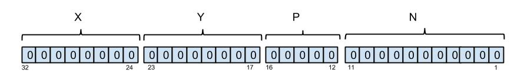

# The version described here is no longer supported. 

[Home page for current version](/) 

This page describes the information required to be able to inject data into SpiNNaker machines.

# Page Contents
* [Installation Instructions](#installation)
* [Disclaimer](#disclaimer)
* [EIEIO messages](#eieio)
* [Example](#example)
* [Spike Injected Synfire chain](#synfire)
* [Packet Injector](#injector) 
* [ReverseIPTagableVertex](#reverse)
* [Trouble shooting](#trouble)

# <a name="installation"></a> Installation Instructions

To support a live stream of data from a SpiNNaker machine, needs the [**sPyNNakerExternalDevicesPlugin**](https://github.com/SpiNNakerManchester/sPyNNakerExternalDevicesPlugin/tree/2015.007) installation which requires the end user to **open a terminal / cmd prompt** and run the command:

```pip install sPyNNakerExternalDevicesPlugin```

This now allows import of the sPyNNakerExternalDevicesPlugin module in your PyNN script though the command:

```import spynnaker_external_devices_plugin.pyNN as externaldevices```


# <a name="disclaimer"></a> Disclaimer

The first thing that to be aware of is that packet injection during runtime is not what standard PyNN functionality. Therefore the sPyNNaker tool chain splits standard PyNN functionality (sPyNNaker front end module) with non-standard PyNN functionality (sPyNNakerWithExternalDevices, sPyNNakerRecurrentSTDPPlugin). 

All of the support for data injection into SpiNNaker exists inside the sPyNNakerWithExternalDevices module. 
The model required to support data injection into a SpiNNaker machine is called the ReverseIPTagableVertex whose source code can be found at  [sPyNNakerWithExternalDevices/spynnaker_external_devices_plugin/control_models/reverse_ip_tag_mulit_cast_source.py](https://github.com/SpiNNakerManchester/sPyNNakerExternalDevicesPlugin/tree/2015.007/spynnaker_external_devices_plugin/pyNN/control_models/reverse_ip_tag_multi_cast_source.py).

The rest of this page walks through the use of the **reverse_ip_tag_mulit_cast_source** model via two examples stored inside the [sPNNakerWithExternalDevices/examples/](https://github.com/SpiNNakerManchester/sPyNNakerExternalDevicesPlugin/tree/2015.007/examples) folder.

# <a name="eieio"></a> EIEIO Messages

All interfaces into and out of a SpiNNaker machine are encapsulated within a External-Internal-Event-Input-Output (EIEIO) protocol format. A more clear definition of EIEIO protocol can be found at: [EIEIO Protocol](EIEIOProtocolProposal.pdf).

The reverse_ip_tag_mulit_cast_source model expects packets being sent to it to be in a EIEIO Message format.


# <a name="example"></a> Example Usage

[PyNNExamples/examples/external_device_examples/injection_scripts/spike_injection.py
](https://github.com/SpiNNakerManchester/PyNNExamples/tree/f742b9816e402558fe23bde31e8abcb266e709b5/examples/external_device_examples/injection_scripts/spike_injection.py) contains a synfire chain which is stimulated by spike sources external to the SpiNNaker machine. The  [PyNNExamples/examples/external_device_examples/injection_scripts/host_based_injector_tester.py
](https://github.com/SpiNNakerManchester/PyNNExamples/tree/f742b9816e402558fe23bde31e8abcb266e709b5/examples/external_device_examples/injection_scripts/host_based_injector_tester.py) sends a collection of EIEIO messages which covers the entire combination of EIEIO headers. 

**NOTE**: It is worth noting that no sPyNNaker models handle MC packets with payloads, so it is recommended to not send packets with payloads unless there exists some proxy model to handle the transition between MC with payload into a MC packet for transmissions.

# <a name="synfire"></a> Spike Injected Synfire chain

The [spike_injection](https://github.com/SpiNNakerManchester/PyNNExamples/tree/f742b9816e402558fe23bde31e8abcb266e709b5/examples/external_device_examples/injection_scripts/spike_injection.py) example code on line 51-55 shows an instantiation of a _ReverseIpTagMultiCastSource_ model which is inherited from the [sPyNNakerExternalDevicesPlugin](https://github.com/SpiNNakerManchester/sPyNNakerExternalDevicesPlugin/tree/2015.007) module (referred to by the **_externaldevices_**). 

`populations.append(
    frontend.Population(nNeurons, externaldevices.ReverseIpTagMultiCastSource,
                        cell_params_spike_injector_with_prefix,
                        label='spike_injector_1'))`

Lines 23 to 34 show two different sets of parameters used to configure the _ReverseIpTagMultiCastSource_. Lines 23 to 27 define a _ReverseIpTagMultiCastSource_  which does not contain a prefix, and therefore EIEIO packets being transmitted to the SpiNNaker machine on port 12345 will require to contain a 32 bit key.

`cell_params_spike_injector = {'host_port_number' : 12345,
                              'host_ip_address'  : "localhost",
                              'virtual_key'      : 458752,
                              'prefix'           : None,
                              'tag'              : None}`

Lines 28 to 34 shows a set of parameters for configuring the _ReverseIpTagMultiCastSource_ which does contain a prefix to be added to the top 16 bits of any key (in this case, the value **7**) contained within a received EIEIO message. Yet again, this model is configured to receive EIEIO packets sent to the SpiNNaker machine on port 12345.

`cell_params_spike_injector_with_prefix = {'host_port_number' : 12345,
                                          'host_ip_address'  : "localhost",
                                          'virtual_key'      : 458752,
                                          'prefix'           : 7,
                                          'tag'              : None}`

# <a name="injector"></a> Packet Injector

The [host_based_injector_tester.py](https://github.com/SpiNNakerManchester/PyNNExamples/tree/f742b9816e402558fe23bde31e8abcb266e709b5/examples/external_device_examples/injection_scripts/host_based_injector_tester.py) contains a sequence of EIEIO messages being created and transmitted to a SpiNNaker machine. Line 8, contains a **ReverseIPTagConnection** (imported on line 5) which has been instantiated to connect to the SpiNNaker board on hostname **spinn-9.cs.man.ac.uk** on the same port number (12345) as defined in the spike_injection's **ReverseIpTagMultiCastSource** port. The reason for a **ReverseIPTagConnection** is to reflect communication with a  **ReverseIpTagMultiCastSource** model and, to date, this is the only connection which supports sending EIEIO messages.

**NOTE: Before running this example, please change the parameter _remote_host_ to point to your own board.**

`from spinnman.connections.udp_packet_connections.reverse_iptag_connection import ReverseIPTagConnection
...
udp_connection = ReverseIPTagConnection(remote_host="spinn-9.cs.man.ac.uk",
                                        remote_port=12345)`

As this example is in Python, you can import the data structures used by [spinnman](https://github.com/SpiNNakerManchester/SpiNNMan/tree/2015.002) to handle EIEIO Messages (as seen on lines 1 to 4) which consist of a [EIEIOHeader](https://github.com/SpiNNakerManchester/SpiNNMan/tree/2015.002/spinnman/messages/eieio/eieio_header.py),  [EIEIOMessage](https://github.com/SpiNNakerManchester/SpiNNMan/tree/2015.002/spinnman/messages/eieio/eieio_message.py), [EIEIOCommandMesage](https://github.com/SpiNNakerManchester/SpiNNMan/tree/2015.002/spinnman/messages/eieio/eieio_command_message.py), [EIEIOCommandHeader](https://github.com/SpiNNakerManchester/SpiNNMan/tree/2015.002/spinnman/messages/eieio/eieio_command_header.py), [EIEIOTypeParam](https://github.com/SpiNNakerManchester/SpiNNMan/tree/2015.002/spinnman/messages/eieio/eieio_prefix_type.py), and a  [EIEIO_prefix_type](https://github.com/SpiNNakerManchester/SpiNNMan/tree/2015.002/spinnman/messages/eieio/eieio_prefix_type.py)). A EIEIO message contains a EIEIO header object as well as a byte_array for data. 
`from spinnman.messages.eieio.eieio_header import EIEIOHeader
from spinnman.messages.eieio.eieio_message import EIEIOMessage
from spinnman.messages.eieio.eieio_type_param import EIEIOTypeParam
from spinnman.messages.eieio.eieio_prefix_type import EIEIOPrefixType`

**NOTE**: There is no need to instantiate the data part of the EIEIOMessage but is done so here for completeness. 

For a EIEIO Header there are a set of 6 parameters as shown below:

`class EIEIOHeader(object):

    def __init__(self, type_param, tag_param=0, prefix_param=None,
                 payload_base=None, prefix_type=None, is_time=False):` 

* **type_param**: The type of message format to be used in the EIEIO Message. This consists of a Enum defined by the [EIEIOTypeParam](https://github.com/SpiNNakerManchester/SpiNNMan/tree/2015.002/spinnman/messages/eieio/eieio_prefix_type.py) Enum which contains either:
1. 16 bit keys
1. 16 bit keys and 16 bit payloads
1. 32 bit keys
1. 32 bit keys and 32 bit payloads

**NOTE**: there is no support for a mixture of different sized keys and payload within the same EIEIO message.

* **tag_param**: The tag parameter from the [EIEIO packet Format definition](2015.003%3a-Just-Testing-%3a-2.3-External-Internal-Event-Input-Output-%28EIEIO%29-Protocol).
* **prefix_param**: The prefix to be or-ed to any key which does not have a prefix and is 16 bit in size.
* **payload_base**: The payload to be or-ed to any payload.
* **prefix_type**: A second Enum which deduces if the prefix is to be applied to the lower or upper 1/2 of the 32 bit key to be transmitted into the SpiNNaker communication fabric. 
* **is_time**: This is a boolean which deduces that the payload base is really a time stamp and therefore should not be or-ed with any payloads. 

**NOTE**: NJote the absence of the _count_ parameter as defined in the [EIEIO protocol](2015.003%3a-Just-Testing-%3a-2.3-External-Internal-Event-Input-Output-%28EIEIO%29-Protocol). The reason this is not included within the EIEIOHeader is that during the addition of data to the EIEIOMessage (discussed below), the EIEIOMessage updates the count parameter of the EIEIOHeader automatically.

On lines 17, 24, 32, 40 etc.. is a command **write_data** to a EIEIO message data object. Note that for packets with payload, using write_data just requires addition of the payload as the second parameter (as shown on line 24).The reason for this function is for ease of end user use, directly because the SpiNNaker memory architecture is in [littleEndianFormat](http://en.wikipedia.org/wiki/Endianness) and therefore a 'short' or a 'int' needs to be converted into littleEndianFormat. Due to this required bit shifting and correct ordering, the functionality native to the EIEIOMessage was added and therefore an end user does not need to worry about such things. 

The EIEIOMessage stores its data within a bytearray for ease of reading-from and writing-to the SpiNNaker  machine. The interface also allows the end user to create a bytearray and add it to a EIEIOMessage during initialisation time. 

The end product of running both the [spike_injector.py](https://github.com/SpiNNakerManchester/PyNNExamples/tree/f742b9816e402558fe23bde31e8abcb266e709b5/examples/external_device_examples/injection_scripts/spike_injection.py) and the [host_based_injector_tester.py](https://github.com/SpiNNakerManchester/PyNNExamples/tree/f742b9816e402558fe23bde31e8abcb266e709b5/examples/external_device_examples/injection_scripts/host_based_injector_tester.py) is a synfire which is set off from a packet injected from the host-machine.


# <a name="reverse"></a> ReverseIPTagableVertex

The ReverseIPTagableVertex works by using a new piece of functionality supported by [SARK](https://github.com/SpiNNakerManchester/spinnaker_tools/tree/2015.002-rc-01/docs/sark.pdf) (SPiNNaker Application Real-time Kernal) called a ReverseIptag. A ReverseIPTag is a IPTAG which states that any packet coming from a given port should be sent to a given destination processor on the machine. 

Considering the parameters from ReverseIPTagableVertex vertex:

`class ReverseIpTagMultiCastSource(AbstractPartitionableVertex,`
                                  `AbstractDataSpecableVertex,`
                                  `AbstractReverseIPTagableVertex):`
`....`
    `#constructor`
    `def __init__(self, n_neurons, host_port_number, host_ip_address, 
                 virtual_key, label, machine_time_step, 
                 timescale_factor=None, tag=None, check_key=True, 
                 prefix=None, key_left_shift=0):`

There are 11 parameters here where many of them are set to default values. 
**NOTE**: If the end user is initialising this model via a PyNN population, then parameters 6 and 10 are included automatically via the [PyNN population](https://github.com/SpiNNakerManchester/sPyNNaker/blob/2015.003/spynnaker/pyNN/models/pynn_population.py) initialisation code on lines 73 and 74. 

* **n_neurons**: The number of _n_neurons_ that are encapsulated within this model. It is recommend that for a basic ReverseIpTagMultiCastSource there should only be 1 neuron.

* **Host_port_number**: The _port number_ to which packets are going to be sent from the external data generator. An example of this would be a spike generator that exists on the host and injects spikes to the SpiNNaker machine on port 19876.

* **host_ip_address**: The _ipaddress_ to which packets are going to be sent from the external data generator. An example of this would be a spike generator that exists on the host and injects spikes to the SpiNNaker machine on the Ethernet connection with IP address 192.168.182.2. Both the **Host_port_number** and **host_ip_address** result in a definition of a socket.

* **virtual_key**: The key that the ReverseIpTagMultiCastSource uses when transmitting the MC packets. This is required to be a single key, as the current tool chain does not support multiple key sets. The reason to define a key is that the MC packets are routed via routing entries within the SpiNNaker machine, therefore the tool chain needs the key to be transmitted with so that it can set up routers correctly.

* **label**: The string definition of the population. This is a user readable id used in reports.

* **machine_time_step**: This is the execution time in ms within which a timer tick is expected to execute. This works in collaboration with the **time_scale_factor** which slows the system down even further. 

* **timescale_factor**: This is the second parameter used to control how quickly the model executes on the machine, it is a multiplication factor to the **machine_time_step**. A **machine_time_step** of 1000 (1ms) and a **timescale_factor** of 10 would result in a timer tic interrupt being set off every 10 milliseconds. Even though the timer tick interrupt is being set off every 10 milliseconds, the model code still operates as if it was running at 1ms time steps.

* **tag**: This is the _tag_ id used by the IPTAG system in SpiNNaker to control where packets going in and out of SpiNNaker go in relation to sockets and processors.

**NOTE:** Parameters 9 to 11 are all to program the model for the type of EIEIO messages it should expect to receive.

* **check_key**: This is a boolean value which, if set, makes the C code check that the key being transmitted by the EIEIO message packet is valid for the routing entry it was set up for. If the key within the EIEIO message packet does not meet the keys expected to trasmit, the packet is not sent to the router to travel through the communication fabric. This is because it is unlikely to have a routing entry and therefore will be sent to the local monitor core and dropped. 

* **prefix**: This a 32 bit number used if the EIEIO packet being injected into SpiNNaker contains 16 bit keys. This is because keys within SpiNNaker are 32 bit numbers and therefore a 16 bit key is ambiguous in how to represent it within the routing system of SpiNNaker. If the EIEIO packet does include 16 bit keys, this prefix is or-ed with the key which may have been left shifted determined by parameter **key_left_shift**. 

* **key_left_shift**: This is an integer value between 0 and 1 which determines if a 16 bit key should be shifted from the lower half word to the upper half word.


# <a name="trouble"></a> Trouble Shooting

This section tries to shed some light on how to use the injector in practice. It is intended to be a basic explanation and may change and evolve with other users input to mistakes, issues etc that are likely to come and go during its evolution. 

**1. How do I determine what virtual_key is needed to define my ReverseIPtagVertex?**

If the device or code that generates or injects packets into SpiNNaker is limited to a fixed key, then the tool chain will require the key in use so that the routing tables are set up correctly. This is what the virtual_key represents.

Without such limitations, defining a virtual_key which when mapped to the standard X|Y|P|N format of packets being injected into spinnaker with the caveat that X and Y have to be between 0 and 7 and together represent a chip that does not exist in the current machine. P must be between 0 and 17. 

**NOTE:** For the standard format for keys within neural simulations on SpiNNaker are defined as follows from left to right:

The first 8 bits represent the X coordinate of a chip,

The next 8 bits represent the Y coordinate of a chip, 

the next 5 bits represent the P processor on a chip, 

the last 11 bits represent the neuron_id. 

Below is a graphical representation of this mapping:



**2. How many keys can be transmitted from one ReverseIpTagVertex?**

Currently the number of "keys" is mapped directly to linked to the number of instantiated neurons.  This is capped at 2048 due to limitations on data structures (**time stamped at 23/1/2015**). The caveat is that the key has to be in a given format as described above and because of this, all 2048 "keys" are masked to one key_combo which is used during routing. If more, or distinct, keys are needed then up to 7 ReverseIpTagVertices can be instantiated before running out of IPTags. 

**NOTE:** As currently the tool chain to 1 48 chip board, there is only 1 Ethernet socket can all data  transferred. This is important, as each Ethernet socket is limited to 7 IPTags and each ReverseIpTagVertex requires one iptag, therefore imposing a limit of 7 ReverseIpTagVertices.

**3. My injected packets are not being sent?** 

1. This could be due to a misalignment between the virtual key defined for the ReverseIpTagVertex and the key being injected. For example, a ReverseIpTagVertex defined with key 0x0708 (maps to chip x =0, chip y = 7, processor 1) and 2048 neurons allows inject keys that range from 0x0708 to key 70FFF. Anything outside this range will not transmitted by default.

**NOTE:** It is possible to disable this behaviour by the use of the check_keys parameter of the ReverseIpTagVertex. This is not recommended as keys not known to the tool chain will not have had their routing entries set up for them, and therefore packets will not be routed at all. 

2. This could also be due to having a firewall configured to reject UDP packets. Configuring a firewall is os dependent, and so we do not focus on how to change the firewall here. 
