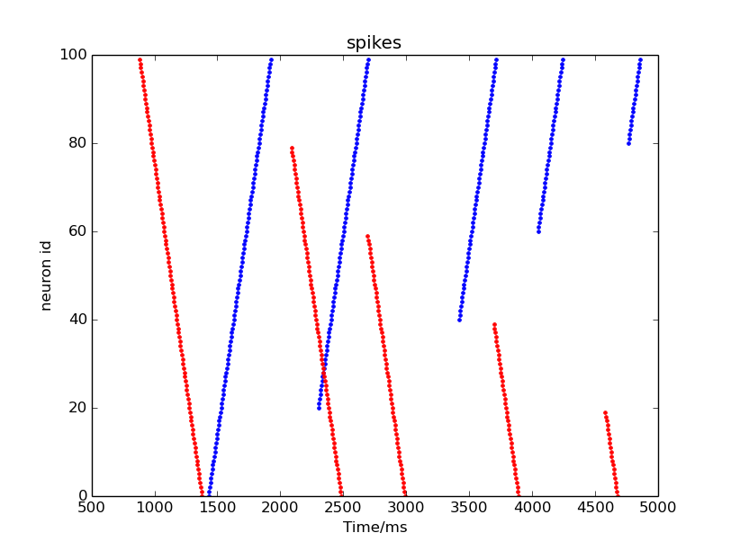

This page describes the information required to be able to inject data into SpiNNaker machines.

## Page Contents
* [Installation Instructions](#installation)
* [Uninstall Instructions](#uninstall)
* [PyNN compatibility](#compatibility)
* [EIEIO messages](#eieio)
* [Example](#example)
* [Spike Injected Synfire chain](#synfire)
* [Packet Injector](#injector)
* [Trouble shooting](#trouble)

# <a name="installation"></a> Installation Instructions

To support a live stream of data in to a SpiNNaker machine, the module [**sPyNNakerExternalDevicesPlugin**](hhttps://github.com/SpiNNakerManchester/sPyNNakerExternalDevicesPlugin/tree/2015.008) is required. To install it **open a terminal / cmd prompt** and run the command:

```pip install sPyNNakerExternalDevicesPlugin```

After this a PyNN script can import the sPyNNakerExternalDevicesPlugin module using the command:

```import spynnaker_external_devices_plugin.pyNN as ExternalDevices```

If you need to upgrade the version of the module at any point in the future, this can be done by [uninstalling](#uninstall) and re-installing the module.

# <a name="uninstall"></a> Uninstall Instructions

To uninstall the current version of the plugin, the end user can **open a terminal / cmd prompt** and run the command:

```pip uninstall sPyNNakerExternalDevicesPlugin```

## <a name="compatibility"></a> PyNN compatibility

PyNN supports a SpikeSourceArray neural population to playback a sequence of spikes known in advance. However, if the neural network being modelled interacts with the external environment through sensors and actuators, it is unlikely that the sequence will be known in advance.

The support for data injection into SpiNNaker has been developed within the sPyNNakerExternalDevicesPlugin module, to acknowledge that these features are provided in addition to standard PyNN functionality.  The models provided are, however, compatible with PyNN, and are usable in the same way as other spike-producing models i.e. by specifying them as the model of a PyNN Population.

The model that supports data injection into a SpiNNaker machine is called the SpikeInjector and its source code can be found at [sPyNNakerExternalDevicesPlugin/spynnaker_external_devices_plugin/pyNN/utility_models/spike_injector.py](https://github.com/SpiNNakerManchester/sPyNNakerExternalDevicesPlugin/tree/2015.008/spynnaker_external_devices_plugin/pyNN/utility_models/spike_injector.py).  The SpikeInjector model expects to receive packets in [EIEIO format](EIEIOProtocolProposal.pdf) via the Ethernet interface.

# <a name="example"></a> Example Usage

An example of **SpikeInjector** model usage is provided in the [spike_io.py](https://github.com/SpiNNakerManchester/PyNNExamples/blob/2015.002/examples/external_device_examples/live_examples/spike_io.py) file.

This file comprises three sections: the initial part describes the neural network in use (lines 21 - 129). The second part sets up the handlers for sending and receiving spikes to/from the SpiNNaker board (lines 131 - 188). The last section runs the simulation, retrieves and displays the result at the end of it (lines 190 - 215).

## <a name="synfire"></a> Spike Injected Synfire chain

The neural network used for this example comprises two populations of leaky integrate-and-fire (LIF) neurons with 100 neurons each (lines 89 - 93):

```
# create synfire populations (if cur exp)
pop_forward = Frontend.Population(n_neurons, Frontend.IF_curr_exp,
                                  cell_params_lif, label='pop_forward')
pop_backward = Frontend.Population(n_neurons, Frontend.IF_curr_exp,
                                   cell_params_lif, label='pop_backward')
```

Then two populations of SpikeInjector neurons are created (lines 95 - 101):

```
# Create injection populations
injector_forward = Frontend.Population(
    n_neurons, ExternalDevices.SpikeInjector,
    cell_params_spike_injector_with_key, label='spike_injector_forward')
injector_backward = Frontend.Population(
    n_neurons, ExternalDevices.SpikeInjector,
    cell_params_spike_injector, label='spike_injector_backward')
```

The first injector population defines a virtual key space to be used when injecting spikes. Therefore the set of keys is already known before configuration. In addition, the receiving UDP port is defined to route packets to this population (lines 69-87):

```
 ##################################
 # Parameters for the injector population.  Note that each injector needs to
 # be given a different port.  The virtual key is assigned here, rather than
 # being allocated later.  As with the above, spikes injected need to match
 # this key, and this will be done automatically with 16-bit keys.
 ##################################
cell_params_spike_injector_with_key = {

    # The port on which the spiNNaker machine should listen for packets.
    # Packets to be injected should be sent to this port on the spiNNaker
    # machine
    'port': 12346,

    # This is the base key to be used for the injection, which is used to
    # allow the keys to be routed around the spiNNaker machine.  This
    # assignment means that 32-bit keys must have the high-order 16-bit
    # set to 0x7; This will automatically be prepended to 16-bit keys.
    'virtual_key': 0x70000
}
```

The second injector population does not define a virtual key space, therefore the set of keys will be dynamically assigned by the toolchain. In addition the receiver port is defined to route packets to this population (lines 51 - 66):

```
 ##################################
 # Parameters for the injector population.  This is the minimal set of
 # parameters required, which is for a set of spikes where the key is not
 # important.  Note that a virtual key *will* be assigned to the population,
 # and that spikes sent which do not match this virtual key will be dropped;
 # however, if spikes are sent using 16-bit keys, they will automatically be
 # made to match the virtual key.  The virtual key assigned can be obtained
 # from the database.
 ##################################
cell_params_spike_injector = {

    # The port on which the spiNNaker machine should listen for packets.
    # Packets to be injected should be sent to this port on the spiNNaker
    # machine
    'port': 12345
}
```

Each unit of the injector population connects to one neuron of the LIF population (lines 103 - 107):

```
# Create a connection from the injector into the populations
Frontend.Projection(injector_forward, pop_forward,
                    Frontend.OneToOneConnector(weights=weight_to_spike))
Frontend.Projection(injector_backward, pop_backward,
                    Frontend.OneToOneConnector(weights=weight_to_spike))
```

Finally the neurons of each LIF population are connected to form two independent chains, the first with forward connections: neuron 0 connects to neuron 1, neuron 1 connects to neuron 2, and so on, and the second with backward connections: neuron 99 connects to neuron 98, neuron 98 connects with neuron 97, and so on (lines 109 - 120):

```
# Synfire chain connections where each neuron is connected to its next neuron
# NOTE: there is no recurrent connection so that each chain stops once it
# reaches the end
loop_forward = list()
loop_backward = list()
for i in range(0, n_neurons - 1):
    loop_forward.append((i, (i + 1) % n_neurons, weight_to_spike, 3))
    loop_backward.append(((i + 1) % n_neurons, i, weight_to_spike, 3))
Frontend.Projection(pop_forward, pop_forward,
                    Frontend.FromListConnector(loop_forward))
Frontend.Projection(pop_backward, pop_backward,
                    Frontend.FromListConnector(loop_backward))
```


## <a name="injector"></a> Packet Injector

The main class for handling packet I/O is SpynnakerLiveSpikesConnection.
This class connects automatically with the database generated by the toolchain and retrives the set of neuron ids to perform automatic translation between neuron ids and routing keys.

This object is defined in line 165 - 167:

```
    live_spikes_connection = SpynnakerLiveSpikesConnection(
        receive_labels=["pop_forward", "pop_backward"],
        send_labels=["spike_injector_forward", "spike_injector_backward"])
```

And contains two main API calls: add_start_callback and add_receive_callback.
The first callback is triggered when the simulation starts and is connected with one particular injector population. The second callback is triggered when an event is received from a particular population (lines 169 - 177):

```
    # Set up callbacks to occur at the start of simulation
    live_spikes_connection.add_start_callback("spike_injector_forward",
                                              send_input_forward)
    live_spikes_connection.add_start_callback("spike_injector_backward",
                                              send_input_backward)

    # Set up callbacks to occur when spikes are received
    live_spikes_connection.add_receive_callback("pop_forward", receive_spikes)
    live_spikes_connection.add_receive_callback("pop_backward", receive_spikes)
```

The functions to send spikes to the injector populations are defined in lines 135 - 153:

```
 # Create a sender of packets for the forward population
def send_input_forward(label, sender):
    for neuron_id in range(0, 100, 20):
        time.sleep(random.random() + 0.5)
        print_condition.acquire()
        print "Sending forward spike", neuron_id
        print_condition.release()
        sender.send_spike(label, neuron_id, send_full_keys=True)


 # Create a sender of packets for the backward population
def send_input_backward(label, sender):
    for neuron_id in range(0, 100, 20):
        real_id = 100 - neuron_id - 1
        time.sleep(random.random() + 0.5)
        print_condition.acquire()
        print "Sending backward spike", real_id
        print_condition.release()
        sender.send_spike(label, real_id)
```

The function to receive events is defined in lines 156 - 161:


```
 # Create a receiver of live spikes
def receive_spikes(label, time, neuron_ids):
    for neuron_id in neuron_ids:
        print_condition.acquire()
        print "Received spike at time", time, "from", label, "-", neuron_id
        print_condition.release()
```

The final part of this example starts the simulation for 8 seconds (lines 190 - 191):

```
# Run the simulation on spiNNaker
Frontend.run(run_time)
```

Then it retrieves recorded spikes and displays them (lines 193 - 209):

```
 # Retrieve spikes from the synfire chain population
spikes_forward = pop_forward.getSpikes()
spikes_backward = pop_backward.getSpikes()

 # If there are spikes, plot using matplotlib
if len(spikes_forward) != 0 or len(spikes_backward) != 0:
    pylab.figure()
    if len(spikes_forward) != 0:
        pylab.plot([i[1] for i in spikes_forward],
                   [i[0] for i in spikes_forward], "b.")
    if len(spikes_backward) != 0:
        pylab.plot([i[1] for i in spikes_backward],
                   [i[0] for i in spikes_backward], "r.")
    pylab.ylabel('neuron id')
    pylab.xlabel('Time/ms')
    pylab.title('spikes')
    pylab.show()
```

Following there is an image which gives an example of the output provided by this test.
However, since the timing between injected spikes has a randomization term (lines 138 and 149), **the figure shown changes slightly at every execution**:



# <a name="trouble"></a> Trouble Shooting

This section tries to answer common questions providing some background on the use of spike injector. It is intended to be more of a basic explanation and may change and evolve with users input on questions, issues and similar that are likely to come.

**1. How many keys can be transmitted from one SpikeInjector?**

The number of keys is determined by the number of units in the definition of the _SpikeInjector_ population in PyNN.
 
**2. What is the packet format I should send to the SpiNNaker machine?**
 
The format is described by the EIEIO protocol, and implemented by the python classes as described [here](EIEIOProtocolProposal.pdf)

**3. My packets are not being sent?** 

Check that the PyNN description and the network and the python script to inject the packet use the same port for injecting spikes. 

To check that packets are actually sent correctly you can use a network packet sniffer (e.g. wireshark) to record the UDP packet in transit on the network.

This could also be due to having a firewall configured to reject UDP packets. Configuring a firewall is os dependent, and so is outside of the scope of this document.
