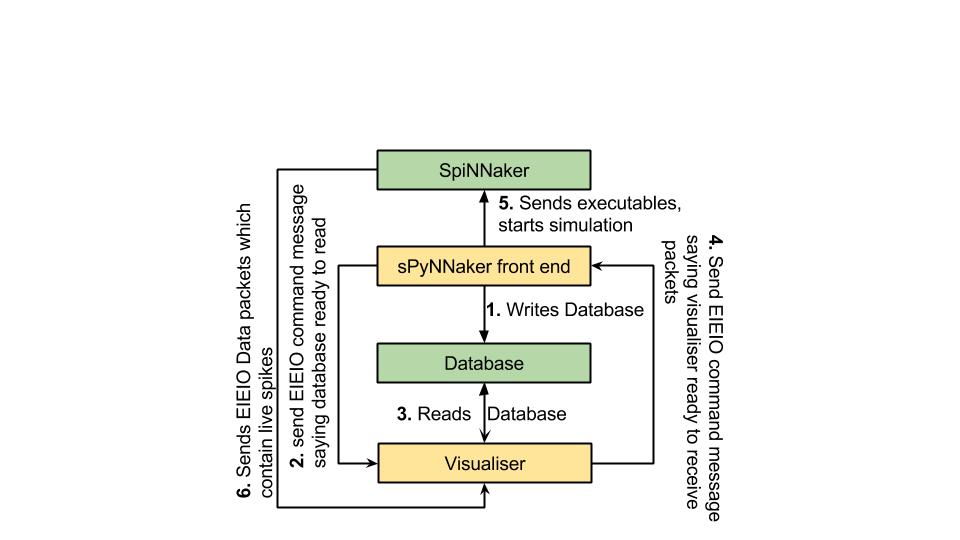
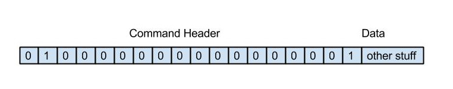
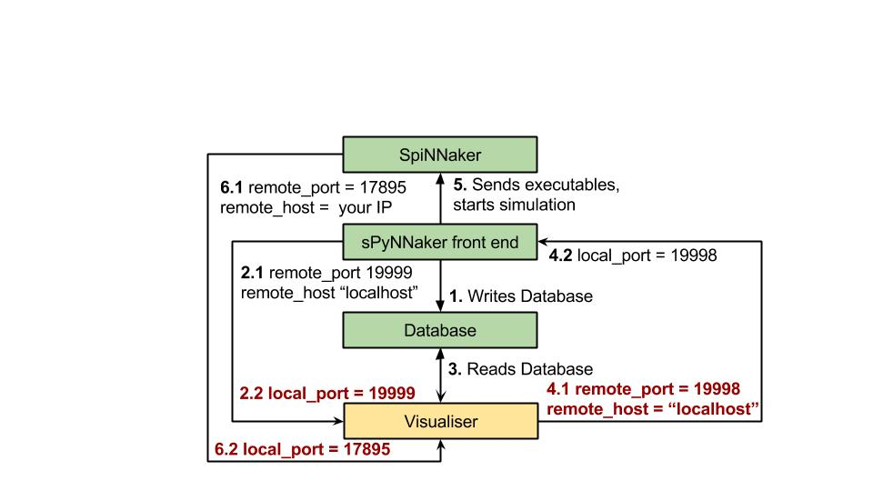

# The version described here is no longer supported. 

[Home page for current version](/) 

# Page Contents
* [Installation Instructions](#installation)
* [Ethos and Disclaimer](#disclaimer)
* [Visualiser Handshake Protocol](#handshake)
* [Database](#database)
* [PyNN setting up for live output](#liveoutput)
* [Python Based Visualiser Receiver](#python_based) 
* [C Based Visualiser Receiver](#c_based)

# <a name="installation"></a> Installation Instructions

To support a live stream of data from a SpiNNaker machine, require the installation of the [**sPyNNakerExternalDevicesPlugin**](https://github.com/SpiNNakerManchester/sPyNNakerExternalDevicesPlugin)  which requires the end user to **open a terminal / cmd prompt** and run the command:

```pip install sPyNNakerExternalDevicesPlugin```

This now allows the sPyNNakerExternalDevicesPlugin module to be imported to your PyNN script though the command:

```import spynnaker_external_devices_plugin.pyNN as externaldevices```

# <a name="disclaimer"></a> Disclaimer

The Ethos of the current tool chain is that a standard visualiser is not supported. An open source framework is supported to which people are welcome to plug their own visualisers. Users are requested that if the visualiser is considered useful to other developers, that you branch off the [visualiser module](https://github.com/SpiNNakerManchester/Visualiser) in the github repos, add your visualiser and make a pull request so that the SpiNNaker software team can have some sort of quality control.

The first thing be aware of is that receiving output during runtime is not standard PyNN functionality. Therefore the tool chain splits standard PyNN functionality (sPyNNaker front end module) with non-standard PyNN functionality (sPyNNakerWithExternalDevices, sPyNNakerRecurrentSTDPPlugin).

All of the support for live output of spikes from a SpiNNaker machine exist inside the sPyNNakerWithExternalDevices module. The model required to support live output is called Live_packet_gather who�s source code is located at [sPyNNakerWithExternalDevices/spynnaker_external_devices_plugin/control_models/Live_packet_gather.py](https://github.com/SpiNNakerManchester/sPyNNakerExternalDevicesPlugin/blob/2015.007/spynnaker_external_devices_plugin/pyNN/control_models/live_packet_gather.py). This model outputs packets in the form of EIEIO data messages, refer to the [EIEIO_protocol](2015.004%3a-Little-Rascal-%3a-2.3-External-Internal-Event-Input-Output-%28EIEIO%29-Protocol) for more details on this works.

The rest of this page walks through how to set up a PyNN script to support live packet output and how to create a receiver for packets in both python and c.

# <a name="handshake"></a> Visualiser Hand shake Protocol

The tool chain can now interact with any visualiser by the use of sockets and EIEIO command messages. The separate parts of the protocol can be turned on or off by the use of the spynnaker.cfg under the section of **[Database]**. The options are **create_database**, **wait_on_confirmation**, **create_routing_info_to_neuron_id_mapping** each of which takes a boolean of _True_ or _False_.

The figure below shows how the interface is expected to operate. 



The **first** stage of the protocol is for the tool chain to create a sqlite database which is explained in greater detail in the next section. This is only done if the **create_database** parameter in the spynnaker.cfg is set to True.

**NOTE:** The location of the database object (which is always located in _application_data/latest/visualiser_database.db_) can be controlled by changing the spynnaker.cfg parameter **[Reports] defaultApplicationDataFilePath**. When this parameter is set to **DEFAULT**, the tool chain will place the application_data folder in the directory where the run script resides. If this parameter is set to a absolute path, the tool chain will place the application_data folder at the end of that path. 

**If you have never updated your spynnaker.cfg file, or this parameter does not exist in your spynnaker.cfg file, please note that the spynnaker.cfg file that is auto-generated by the installation process does not include this parameter. If you look [here](https://github.com/SpiNNakerManchester/sPyNNaker/blob/master/spynnaker/spynnaker.cfg) you will find the _default spynnaker.cfg_ which is used by the tool chain to set defaults. If you copy any parameter from the _default spynnaker.cfg_ and place it in the corresponding area within your own spynnaker.cfg file, your value will override the value within the _default spynnaker.cfg_.**

In the **second** stage, once the database has been written, the tool chain sends a EIEIO command message down a specific port number (currently this is hard-coded at 19999). The current format of the EIEIO command message is the standard EIEIO command message where the command id is set to 1 on the right hand side. As shown below. This message informs the visualiser that if it requires any data for configuration, then the database is now ready to read.



In the **third** stage the visualiser reads the database and does whatever set-up configuration is required to the point where it is ready to receive spikes.

In the **forth** stage the same EIEIO command packet that the visualiser received (from the tool chain to state that the database was ready to be read) is sent back to the tool chain via the same port number. This then tells the tool chain that when it is ready to set off the simulation running, that it can do so safely. 

**NOTE:** For more advanced users, the tool chain waits for this confirmation after having loaded all the application data, IP-Tags, binaries etc. It stops just before sending the signal to move the binaries from the **SYNC0** state into the **RUNNING** state.

The **fifth** stage operates in parallel with the last stage in that the tool chain loads all its application data, IP-Tags, routing_tables etc. This stage also encapsulates the sending of the signal to move the binaries from the **SYNC0** state into the **RUNNING** state.

The **sixth** stage encapsulates the entire runtime of the simulation and consists of the spinnaker machine sending EIEIO Data packets down a specific socket as defined by the PyNN script or the spynnaker.cfg parameters in the [Recording] section (**live_spike_port = 17895, live_spike_host = localhost, live_spike_tag = 1**)

**NOTE: If you have never updated your spynnaker.cfg file, or this parameter does not exist in your spynnaker.cfg file, please note that the spynnaker.cfg file that is auto-generated by the installation process does not include this parameter. If you look [here](https://github.com/SpiNNakerManchester/sPyNNaker/blob/master/spynnaker/spynnaker.cfg) you will find the _default spynnaker.cfg_ which is used by the tool chain to set defaults. If you copy any parameter from the _default spynnaker.cfg_ and place it in the corresponding area within your own spynnaker.cfg file, your value will override the value within the _default spynnaker.cfg_.**

# <a name="database"></a> Database

The database created by the tool chain contains a collection of Tables. This section attempts to explain what is in each table.

The ethos behind the tables within the database is to give any visualiser as much information as possible so that it can configure itself and therefore there are currently 16 tables, each of which can be mapped to some data object used within the python code base**(checked on date 20/1/2015) **. These are as follows:

**Table 1. Machine_chip**: This table contains all the chips discovered in the machine and contains the attributes: 

|Attribute|Definition|
|-------------|--------------|
|no_processors| no_processors contained on this chip|
|chip_x| the chip x dimension id|
|chip_y| the chip y dimension id|
|machine_id| a unique identifier for the machine being used|
|avilableSDRAM| the amount of SDRAM available on this chip (before loading)|

**Table 2. Machine_layout**: This table contains data on the dimensions of the machine being used by the tool chain and contains the attributes: 


|Attribute|Definition|
|-------------|--------------|
|machine_id|the unique identifier for the machine being used|
|x_dimension|the dimension of the machine in the x direction|
|y_dimension| the dimension of the machine in the y direction|

**Table 3. Partitionable_edges**: This table contains data on each edge that was defined in the PyNN script (this can be directly mapped to each projection defined in the PyNN script). The attributes are as follows:

|Attribute|Definition|
|-------------|--------------|
|edge id| A unique identifier for each edge|
|pre_vertex|the partition able vertex from which this edge starts|
|post_vertex| the partition able vertex from which the edge ends|
|edge_label|the label associated with this edge (human readable descriptor)|

**Table 4. Partitionable_vertices**: This table contains data on every vertex that was defined in the PyNN script (this can be directly mapped to each population defined in the PyNN script). The attributes are as follows:

|Attribute|Definition|
|-------------|--------------|
|vertex_id| a unique identifier for each vertex|
|vertex_label| a human readable identifier for each vertex|
|no_atoms|the number of atoms/neurons that this vertex contains|
|max_atom_constrant| the max number of atoms to which each partitioned vertex can contain when splitting up this vertex|
|recorded|a boolean which states if this vertex was set to be have data recorded from it (**NOTE**: that no distinction is made between live recording and SDRAM based recording|

**Table 5. Partitionable_graph**: This table joins together the partition able vertices with their outgoing edges. The attributes are as follows:


|Attribute|Definition|
|-------------|--------------|
|vertex_id|the unique identifier for a specific vertex within the partition able vertices table|
|edge_id| the unique identifier for a specific edge within the partition able edges table|

**Table 6. Partitioned_vertices**: This Table contains all the vertices of the partitioned graph (generated by the partitioner algorithm from PACMAN).  The attributes are as follows:

|Attribute|Definition|
|-------------|--------------|
|vertex_id|the unique identifier for a specific vertex|
|label|the human readable label for the vertex based off the label of its corresponding vertex in the partitionable graph|
|cpu_used|the amount of cpu used by this partitioned vertex for each timer tic (in cycles)|
|sdram_used|the amount of sdram used by this partitioned vertex to store its atoms data (in bytes)|
|dtcm used|the amount of dtcm used by this partitioned vertex during runtime (in bytes)|

**Table 7. Partitioned_edges**: This table contains all the edges generated during partitioning that encapsulates traffic between collections of neurons.  The attributes are as follows:


|Attribute|Definition|
|-------------|--------------|
|edge_id| the unique identifier for a partitioned edge|
|pre_vertex| the unique identifier of a partitioned vertex which corresponds to the source vertex of this partitioned edge|
|post_vertex| the unique identifier of a partitioned vertex which corresponds to the destination vertex of this partitioned edge|
|label| the human readable label for this partitioned edge (generated from the partition able edge

**Table 8. Partitioned_graph**: This table joins together the partitioned vertices with their outgoing edges. The attributes are as follows:

|Attribute|Definition|
|-------------|--------------|
|vertex_id|the unique identifier of the partitioned_vertex in the partitioned_vertices table|
|edge_id|the unique identifier of the partitioned_edge in the partitioned_edges table|

**Table 9. graph_mapper_edges**: This table contains the mappings for the edges between the partition able graph and the partitioned graph. The attributes are as follows:

|Attribute|Definition|
|-------------|--------------|
|partitionable_edge_id| the unique identifier for the edge within the partition able edge table|
|partitioned_edge_id| the unique identifier for the edge within the partitioned edge table|

**Table 10. graph_mapper_vertex**: This table contains the mappings for the vertices between the partition able and partitioned graph. The attributes are as follows:

|Attribute|Definition|
|-------------|--------------|
|partitionable_vertex_id| the unique identifier for the vertex within the partition able vertices table|
|partitioned_vertex_id| the unique identifier for the vertex within the partitioned vertices table|
|lo_atom| |
|hi_atom| these represent the number of atoms that each partitioned vertex contains when associated with the partition able vertex it came from|

**Table 11. Placements**: This table contains the mappings between partitioned vertices and where they are placed on the machine. The attributes are as follows:

|Attribute|Definition|
|-------------|--------------|
|vertex_id| the unique identifier for the partitioned vertex in the partitioned vertex table|
|machine_id| the unique identifier for the machine to which the partitioned vertex has been placed|
|chip_x| |
|chip_y| |
|chip_p| these together map to a coordinate on the machine to which this partitioned vertex has been placed. (maps to the x and y coordinates of the chip and the processor value within the chip|

**Table 12. Processor**: This table contains the specific data on each processor within the machine. The attributes are as follows:


|Attribute|Definition|
|-------------|--------------|
|chip_x| The x coordinate of the chip to which a processor lives on the SpiNNaker machine.|
|chip_y| The y coordinate of the chip to which a processor lives on the SpiNNaker machine.|
|machine_id|This is a unique identifier for a given machine from the machine table|
|physical_id|This is the processor id given to it during boot up, this ranges between 1 and 17|
|avilable_DTCM| these are the limited resources which are processor specific. These give the maximum value that was deduced from the machine during machine exploration|
|avilable_CPU| these are the limited resources which are processor specific. These give the maximum value that was deduced from the machine during machine exploration|

**Table 13. Routing_info**: This table contains each routing information stored on a edge per edge basis. The attributes are as follows:

|Attribute|Definition|
|-------------|--------------|
|edge_id| This is the unique identifier for the partitioned edge in the partitioned edges table|
|key| the routing key to be used during routing by this partitioned edge |
|mask| the mask used during routing by this partitioned edge|

**Table 14. Routing_table**: This table contains all the routing entries for every router in the machine. The attributes are as follows:

|Attribute|Definition|
|-------------|--------------|
|chip_x|The x coordinate of the chip to which a router lives on the SpiNNaker machine.|
|chip_y|The y coordinate of the chip to which a router lives on the SpiNNaker machine.|
|position|The position of this routing entry in the given routing table|
|key_combo|The value of the key combo which is used to check if a incoming key (when masked with this entry's mask), meets this key_combo in this routing table. NOTE: This is the principle behind how the multicast router works when receiving a multicast packet |
|mask| The mask that is used in the routing entry which is applied to the multi-cast packet's key during the multicast routers processing |
|route| The route used by this multicast routing entry if the multicast router determines that the entry is a valid hit for the incoming multi-cast packet's key and that the entry is the highest in the order. The route value can be broken down into 24 bits where the first 6 from the right side represent the 6 links to other routers from this router and the last 18 bits represent the 18 cores located on the chip this router manages.|

**Table 15. Configuration_parameters**: This table contains system data which has been considered useful to visualisers. This ranges from:

1. The runtime of the simulation, 
2. The machine_time_step of the simulation, 
3. and the time_scale_factor of the simulation. 

The attributes of the table are as follows:

|Attribute|Definition|
|-------------|--------------|
|parameter_id | The unique name for this parameter|
|value| the value of the parameter|

NOTE: that the value is the actual value and that the parameter_id's are currently set to "machine_time_step", "time_scale_factor" and "runtime". This was correct at time of writing 22.jan.2015

**Table 16. key_to_neuron_mapping**: This table contains a mapping between what keys are possible to be received from the simulation by a visualiser and what neuron id from which partition able vertex it came from. The attributes are as follows:

|Attribute|Definition|
|-------------|--------------|
|vertex_id| The unique identifier for the partition able vertex from the partition able vertices table.|
|key| The multi-cast routing key that will be transmitted from the spinnaker machine|
|neuron_id| The neuron_id which this key represents within the partition able population that it came from.|

# <a name="liveoutput"></a> Setting up your PyNN script

To understand how to set up your PyNN script so that spikes are streamed live to your visualiser, please refer to the [2.2 Extracting data out of a simulation on a SpiNNaker machine in real time](ExtractingDataRealTime.html) page.

# <a name="python_based"></a> Python Based Visualiser Receiver

To build a python visualiser, there is a lot of support for building connections within the [SpinnMan module](https://github.com/SpiNNakerManchester/SpiNNMan). 

**NOTE:** as shown below, there are 3 separate connections that any visualiser needs to maintain when using the spiNNaker machine. These are: 

1. the database hand shake receiving connection, 

2. the database handshaking sending connection ,

3. and the SpiNNaker machines outputted packets connection.

Below is a figure which shows the different port numbers and host names as needed.




# <a name="c_based"></a> C Based Visualiser Receiver

A working version of a c based visualiser can be found in the [visualiser module](https://github.com/SpiNNakerManchester/Visualiser). Currently the visualiser supports the generation of a raster plot from live output. 

**NOTE:** If you intend to build upon this visualiser, please feel free to do so, but if your visualiser could be used by multiple people, we ask that you email the developers so that it can be added in future releases. 

The classes for using the database and handling the handshaking between the tool chain and the visualiser can be found in [c_based_visualiser_framework/utilities/](https://github.com/SpiNNakerManchester/Visualiser/tree/master/c_based_visualiser_framework/utilities) and are the [DatabaseMessageConnection.cpp](https://github.com/SpiNNakerManchester/Visualiser/blob/master/c_based_visualiser_framework/utilities/DatabaseMessageConnection.cpp) and [DatabaseReader.cpp](https://github.com/SpiNNakerManchester/Visualiser/blob/master/c_based_visualiser_framework/utilities/DatabaseReader.cpp) classes. 

The classes asscoiated with the connecting with the SpiNNaker machine and receiving packets can be found in [c_based_visualiser_framework/utilities/SocketQueuer.cpp](https://github.com/SpiNNakerManchester/Visualiser/blob/master/c_based_visualiser_framework/utilities/SocketQueuer.cpp) and [c_based_visualiser_framework/raster_view/PacketConverter.cpp](https://github.com/SpiNNakerManchester/Visualiser/blob/master/c_based_visualiser_framework/raster_view/PacketConverter.cpp). 

 