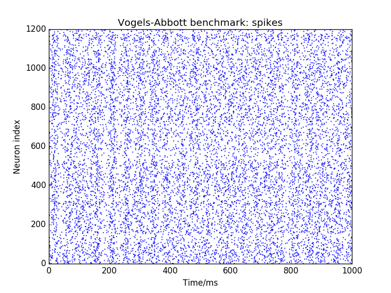

# Installation

 1. [Install Python requirements](#PythonRequirements).
 1. [Install the C development requirements](/common_pages/3.0.0/Compiler.html).
 1. [Install Java Development Kit (JDK)](http://www.oracle.com/technetwork/java/javase/downloads/index.html) - only required if modifying the Remote Access software for the Human Brain Project portal, or if you are going to use an IDE.
 1. [Install an IDE](#ide) - optional but recommended for ease of use.
 1. [Clone the git repositories](#git).
 1. [Install the python software in developer mode](#install).
 1. [Set up the C environment variables](#cenvironment).
 1. [Build the C code](#cbuild).
 1. [Set up the environment for PyNN 0.7 and 0.8](#PyNNSelect).
 1. [Set up the PyNN links](#PyNNInstall).
 1. [Configure the environment](#Configuration).
 1. [Run some examples](#Examples).

# <a name="PythonRequirements"></a> Python Requirements
  1. [Install the general platform requirements](/common_pages/3.0.0/PythonInstall.html)
  1. If you would prefer to use a virtualenv, [follow these instructions](/common_pages/3.0.0/VirtualEnv.html) to set up the dependencies.
  1. Install other general dependencies via pip:
    ```pip install enum34 six "spalloc>=0.2.2,<1.0.0" "requests>=2.4.1" jsonschema "rig>=2.0.0,<3.0.0" "quantities>=0.11.1,<=0.11.1" "lazyarray>=0.2.9,<=0.2.9" "appdirs>=1.4.2,<2.0.0" "neo>=0.3.0,<=0.4.1"```

# <a name="CRequirements"></a> C Development Requirements
[Install a C compiler](/common_pages/3.0.0/Compiler.html) that is compatible with SpiNNaker and dependencies.

# <a name="ide"></a> Integrated Development Environment
Although optional, we recommend the use of an Integrated Development Environment (IDE).  The code-base is large and complex and and IDE helps to simplify the development process.  Within the team at Manchester, we use two IDEs with different benefits and issues.  The installation of these is detailed below.

 * [PyCharm](https://www.jetbrains.com/pycharm/) - Version 4.5.3 has been tested but other versions should also work. This is very good for Python development and supports C development as well to some degree.  Java development is not supported in this client.  PyCharm is good at working out the links between Python code.

 * [Eclipse](https://eclipse.org/downloads/eclipse-packages/) - Eclipse Neon has been tested, but other versions should also work.  So far, we have been downloading the "Eclipse IDE for Java Developers" as the starting point, and then adding the packages as detailed below.  Eclipse supports development in multiple languages through the addition of plugins.  Several plugins exist for doing a wide variety of development tasks, including Python C and Java; Eclipse is the way to go if you are planning on developing in Java.  Eclipse is known to require quite a lot of memory (around 1GB just for eclipse).  Plugins required are:
    * PyDev - This is required for Python Development.  This can be installed from the Eclipse Marketplace (Help...Eclipse MarketPlace...) by searching for pydev.
    * AnyEditTools - This enables useful features like converting tabs to spaces and removing trailing spaces on save.  This can be installed from the Eclipse Marketplace (Help...Eclipse MarketPlace...) by searching for AnyEditTools.
    * CDT - This is required for C Development.  This has to be installed from the Help...Install New Software... menu option.  Here, paste in this url: CDT - http://download.eclipse.org/tools/cdt/releases/9.0.  You can then select to install "C/C++ Development Tools" as well as "C/C++ GCC Cross Compiler Support", "C/C++ Autotools Support" and "C/C++ Hardware Debugging".

# <a name="git"></a> Git Cloning

The repositories to be cloned are shown below.  If you are using an IDE, it is recommended that all modules are cloned so that any changes made are automatically reflected across the entirity of the software.

|**Name**|**URL**|**Code Type**|
|:-------|:------|:------------|
|spinnaker_tools | https://github.com/SpiNNakerManchester/spinnaker_tools.git|C|
|spinn_common | https://github.com/SpiNNakerManchester/spinn_common.git|C|
|SpiNNUtilities | https://github.com/SpiNNakerManchester/SpiNNUtils.git|Python|
|SpiNNMachine | https://github.com/SpiNNakerManchester/SpiNNMachine.git|Python|
|SpiNNStorageHandlers | https://github.com/SpiNNakerManchester/SpiNNStorageHandlers.git|Python|
|PACMAN | https://github.com/SpiNNakerManchester/PACMAN.git|Python|
|SpiNNMan | https://github.com/SpiNNakerManchester/SpiNNMan.git|Python and C|
|DataSpecification | https://github.com/SpiNNakerManchester/DataSpecification.git|Python|
|SpiNNFrontEndCommon | https://github.com/SpiNNakerManchester/SpiNNFrontEndCommon.git|Python and C|
|SpiNNakerGraphFrontEnd | https://github.com/SpiNNakerManchester/SpiNNakerGraphFrontEnd.git|Python and C|
|sPyNNaker | https://github.com/SpiNNakerManchester/sPyNNaker.git|Python and C|
|sPyNNaker7 | https://github.com/SpiNNakerManchester/sPyNNaker7.git|Python|
|sPyNNaker8 | https://github.com/SpiNNakerManchester/sPyNNaker8.git|Python|
|sPyNNakerExternalDevicesPlugin | https://github.com/SpiNNakerManchester/sPyNNakerExternalDevicesPlugin.git|Python and C|
|sPyNNaker7ExternalDevicesPlugin | https://github.com/SpiNNakerManchester/sPyNNaker7ExternalDevicesPlugin.git|Python|
|sPyNNaker8ExternalDevicesPlugin | https://github.com/SpiNNakerManchester/sPyNNaker8ExternalDevicesPlugin.git|Python|
|sPyNNakerExtraModelsPlugin | https://github.com/SpiNNakerManchester/sPyNNakerExtraModelsPlugin.git|Python and C|
|sPyNNaker7ExtraModelsPlugin | https://github.com/SpiNNakerManchester/sPyNNaker7ExtraModelsPlugin.git|Python|
|sPyNNaker8ExtraModelsPlugin | https://github.com/SpiNNakerManchester/sPyNNaker8ExtraModelsPlugin.git|Python|
|sPyNNaker7NewModelTemplate | https://github.com/SpiNNakerManchester/sPyNNaker7NewModelTemplate.git|Python and C|
|sPyNNaker8NewModelTemplate | https://github.com/SpiNNakerManchester/sPyNNaker8NewModelTemplate.git|Python and C|
|PyNN7Examples | https://github.com/SpiNNakerManchester/PyNN7Examples.git|Python|
|PyNN8Examples | https://github.com/SpiNNakerManchester/PyNN8Examples.git|Python|
|IntroLab | https://github.com/SpiNNakerManchester/IntroLab.git|Python|

## Command line

To clone using git on the command line, run:

    git clone <url>

where ```url``` is one of the URLs from above.  It is recommended that all modules be installed into the same directory.

## PyCharm

For each repository:

 1. Go to VCS -> Checkout from Version Control -> github
 1. In "Git Repository URL" enter the repository URL.
 1. Click Clone.

### Dependencies
You will also need to set up the dependencies between projects.

This is done as follows:

 1. Go to File->settings->project: <name>
 1. Select Project Dependencies
 1. Select the module and then tick the [appropriate dependencies](#pythondependencies)

## Eclipse

For each repository:

 1. Go to file -> import -> git -> projects from git -> Clone URI
 1. In "URI"  enter the repository URI.
 1. Click Finish
 1. Once the repository is imported:
     1. If the project is a Python project, right click and select "PyDev" --> "Set as PyDev Project".
     1. If the project is a C project:
         1. Select "File" --> "New" --> "Other..."
         1. Select "C/C++" --> "Convert to a C/C++ Project (Adds C Nature)" and click on "Next"
         1. Select the project from the list.
         1. Select the "C Project" radio button.
         1. Select "Executable" and the "Cross GCC" from the list.
         1. Click on "Finish".
     1. If the project is a Python and C project:
         1. If the project is a Python project, right click and select "PyDev" --> "Set as PyDev Project".
         1. Select "File" --> "New" --> "Other..."
         1. Select "C/C++" --> "C Project" and click on "Next".
         1. Enter the name of the project followed by "_c_code".
         1. Uncheck "use default location", click on "Browse" and find the subfolder of the project containing the C code (e.g. sPyNNaker has a neural_modelling subfolder).
         1. Select "Exectuable" --> "Empty Project" and "Cross GCC" and click on "Next".
         1. Select "Next" again.
         1. Set the "Cross Compiler Prefix" to "arm-none-eabi-"
         1. Set the path of the compiler to wherever you installed it (on Windows using MSYS installed to the ```C:\``` folder, this is ```C:\Program Files (x86)\GNU Tools ARM Embedded\4.8 2013q4\bin.```
         1. Click on "Finish".

### Dependencies
You will also need to set up the dependencies between projects.

In each Python project, this is done as follows:

 1. Right-click on the project
 1. Select "Properties"
 1. Select "Project References".
 1. Tick the [appropriate dependencies](#pythondependencies) for each module.

In a C project, this is done as follows:
 1. Right-click on the project
 1. Select "Properties"
 1. Select "C/C++ Build" --> "Settings"
 1. In the "Tools Settings" tab, select "Cross GCC Compiler" --> "Includes"
 1. Click on the "Add" icon.
 1. Add the dependency as ```${workspace_loc:<dependency_path>}``` where ```<dependency_path>``` is the [appropriate dependency](#cdependencies).
 1. Repeat for all the dependencies.

## <a name="pythondependencies"></a> Python Dependencies

|**Module**|**Dependencies**|
|:---------|:---------------|
|SpiNNMachine|SpiNNUtilities|
|SpiNNMan|SpiNNUtilities, SpiNNMachine, SpiNNStorageHandlers|
|PACMAN|SpiNNUtilities, SpiNNMachine|
|DataSpecification|SpiNNUtilities, SpiNNMachine, SpiNNStorageHandlers|
|SpiNNFrontEndCommon|SpiNNUtilities, SpiNNMachine, SpiNNStorageHandlers, SpiNNMan, PACMAN, DataSpecification|
|SpiNNakerGraphFrontEnd|SpiNNUtilities, SpiNNMachine, SpiNNStorageHandlers, SpiNNMan, PACMAN, DataSpecification, SpiNNFrontEndCommon|
|sPyNNaker|SpiNNUtilities, SpiNNMachine, SpiNNStorageHandlers, SpiNNMan, PACMAN, DataSpecification, SpiNNFrontEndCommon|
|sPyNNaker7|SpiNNUtilities, SpiNNMachine, SpiNNStorageHandlers, SpiNNMan, PACMAN, DataSpecification, SpiNNFrontEndCommon, sPyNNaker|
|sPyNNaker8|SpiNNUtilities, SpiNNMachine, SpiNNStorageHandlers, SpiNNMan, PACMAN, DataSpecification, SpiNNFrontEndCommon, sPyNNaker|
|sPyNNakerExternalDevicesPlugin|SpiNNUtilities, SpiNNMachine, SpiNNStorageHandlers, SpiNNMan, PACMAN, DataSpecification, SpiNNFrontEndCommon, sPyNNaker|
|sPyNNaker7ExternalDevicesPlugin|SpiNNUtilities, SpiNNMachine, SpiNNStorageHandlers, SpiNNMan, PACMAN, DataSpecification, SpiNNFrontEndCommon, spyNNaker, sPyNNaker7, sPyNNakerExternalDevicesPlugin|
|sPyNNaker8ExternalDevicesPlugin|SpiNNUtilities, SpiNNMachine, SpiNNStorageHandlers, SpiNNMan, PACMAN, DataSpecification, SpiNNFrontEndCommon, sPyNNaker, sPyNNaker8, sPyNNakerExternalDevicesPlugin|
|sPyNNakerExtraModelsPlugin|SpiNNUtilities, SpiNNMachine, SpiNNStorageHandlers, SpiNNMan, PACMAN, DataSpecification, SpiNNFrontEndCommon, sPyNNaker|
sPyNNaker7ExtraModelsPlugin|SpiNNUtilities, SpiNNMachine, SpiNNStorageHandlers, SpiNNMan, PACMAN, DataSpecification, SpiNNFrontEndCommon, sPyNNaker, sPyNNaker7, sPyNNakerExtraModelsPlugin|
sPyNNaker8ExtraModelsPlugin|SpiNNUtilities, SpiNNMachine, SpiNNStorageHandlers, SpiNNMan, PACMAN, DataSpecification, SpiNNFrontEndCommon, sPyNNaker, sPyNNaker8, sPyNNakerExtraModelsPlugin|
|sPyNNaker7NewModelTemplate|SpiNNUtilities, SpiNNMachine, SpiNNStorageHandlers, SpiNNMan, PACMAN, DataSpecification, SpiNNFrontEndCommon, sPyNNaker, sPyNNaker7|
|sPyNNaker8NewModelTemplate|SpiNNUtilities, SpiNNMachine, SpiNNStorageHandlers, SpiNNMan, PACMAN, DataSpecification, SpiNNFrontEndCommon, sPyNNaker, sPyNNaker8|
|PyNN7Examples|SpiNNUtilities, SpiNNMachine, SpiNNStorageHandlers, SpiNNMan, PACMAN, DataSpecification, SpiNNFrontEndCommon, sPyNNaker, sPyNNaker7, sPyNNakerExternalDevicesPlugin, sPyNNaker7ExternalDevicesPlugin|
|PyNN8Examples|SpiNNUtilities, SpiNNMachine, SpiNNStorageHandlers, SpiNNMan, PACMAN, DataSpecification, SpiNNFrontEndCommon, sPyNNaker, sPyNNaker8, sPyNNakerExternalDevicesPlugin, sPyNNaker8ExternalDevicesPlugin|
|IntroLab|SpiNNUtilities, SpiNNMachine, SpiNNStorageHandlers, SpiNNMan, PACMAN, DataSpecification, SpiNNFrontEndCommon, SpiNNakerGraphFrontEnd, sPyNNaker, sPyNNaker7|


## <a name="cdependencies"></a> C Dependencies

Note that include files are generally installed into ```spinnaker_tools/include```, thus even when a C module is dependent on another library, you only need to add this location.  The C code in sPyNNaker is an exception as some of the headers are dynamically included during the build, and so it is not possible to provide a pre-built library for sPyNNaker neural modelling.

|**Module Folder**|**Include Dependencies**|
|:----------------|:-----------------------|
|spinn_common|spinnaker_tools/include|
|SpiNNMan/c_models|spinnaker_tools/include|
|SpiNNFrontEndCommon/c_common|spinnaker_tools/include|
|SpiNNakerGraphFrontEnd/spinnaker_graph_front_end/examples|spinnaker_tools/include|
|sPyNNaker/neural_modelling|spinnaker_tools/include|
|sPyNNakerExternalDevicesPlugin/neural_modelling|spinnaker_tools/include, sPyNNaker/neural_modelling/src|
|sPyNNakerExtraModelsPlugin/neural_modelling|spinnaker_tools/include, sPyNNaker/neural_modelling/src|
|sPyNNaker7NewModelTemplate/c_models|spinnaker_tools/include, sPyNNaker/neural_modelling/src|
|sPyNNaker8NewModelTemplate/c_models|spinnaker_tools/include, sPyNNaker/neural_modelling/src|

# <a name="install"></a> Installing Python Modules

Installing the Python modules in developer mode allows you to use the modules from the command line.  Note that the IDEs allow you to run code directly within the IDE, and so this step is optional if you have installed and IDE.  Even when using an IDE, it can be useful to install the modules to avoid issues with the install.

For each of the python modules, go into the root directory of the module and run:

    [sudo] python setup.py develop --no-deps [--user]

Where ```sudo``` is required if you are on Linux or OS X and would like to install the dependencies as root (on windows you would need to open a console as Administrator); and ```--user``` is required if you would like to install the modules under your user.  Neither are required if you are using a virtualenv.

# <a name="cenvironment"></a> Set up the C environment variables

 1. Create an environment variable ```SPINN_DIRS``` that points at the location of the cloned spinnaker_tools folder (note that in Windows, this should be the MinGW Posix path e.g. if you have extracted the archive to ```C:\SpiNNaker-Tools\```, you should set the environment variable to ```/c/SpiNNaker-Tools```).
 1. Add the ```spinnaker_tools/tools``` folder to your ```PATH``` environment variable.  This does *not* need to be a POSIX path on Windows e.g. ```C:\spinnaker_tools\tools``` is fine on Windows, or ```/spinnaker_tools/tools``` on Linux or Mac.
 1. Add the ```spinnaker_tools/tools``` folder to your ```PERL5LIB``` environment variable (or create this environment variable if it is not already set; note that in Windows, this should be the MinGW Posix path e.g. if you have extracted the archive to ```C:\spinnaker_tools\```, you should set the environment variable to ```/c/spinnaker_tools/tools```).
 1. Create a new environment variable ```NEURAL_MODELLING_DIRS``` which is set to the path of the ```neural_modelling``` subfolder of the extracted archive (note that in Windows, this should be the MinGW Posix path e.g. if you have extracted the archive to ```C:\sPyNNaker\```, you should set the environment variable to ```/c/sPyNNaker/neural_modelling```).

# <a name="cbuild"></a> Build the C Code

The C code to compile is (in order) as follows:

|**Module**|**Sub Folder**|**Commands**|**Clean Command**|
|:-----|:---------|:-------|:------------|
|spinnaker_tools||```make```|```make clean```|
|spinn_common||```make```<br>```make install```|```make clean```|
|SpiNNMan|c_models|```make```|```make clean```|
|SpiNNFrontEndCommon|c_common|```make```<br>```make install```|```make clean```|
|SpiNNakerGraphFrontEnd|spinnaker_graph_front_end/examples|```make```|```make clean```|
|sPyNNaker|neural_modelling|```make```|```make clean```|
|sPyNNakerExternalDevicesPlugin|neural_modelling|```make```|```make clean```|
|sPyNNakerExtraModelsPlugin|neural_modelling|```make```|```make clean```|
|sPyNNaker7NewModelTemplate|c_models|```make```|```make clean```|
|sPyNNaker8NewModelTemplate|c_models|```make```|```make clean```|

A script is also available [here](automatic_make.sh) which performs the appropriate steps for you.  Note that it will clean and build everything every time it is run; this may take some time.  Note also that this assumes that you have checked out the git code into a single location.

## Building individual models
Note that in many cases, the top-level Makefile for a module may descend in to a number of sub-directories and build a number of individual models and libraries.  It is always possible to go into these subdirectories yourself and build the individual model directly.  This will save some time, since it will only build the code in the module you are interested in.  This may be necessary when debugging code.

# <a name="PyNNSelect"></a> PyNN 0.75 vs PyNN 0.8

Due to the lack of backwards compatibility with PyNN 0.8 in relation to PyNN 0.75, installing both versions requires a bit of finessing.

## Pycharm

If you decided to use PyCharm to support your development, then to support both PyNN installations you are required to:
 * build 2 versions of your python interpreter with PyNN 0.75 and PyNN 0.8 installed separately.
 * set the python interpreter for each module accordingly.

To achieve the first, please follow the following steps:
 * go to File -> settings -> project -> python interpreter.
 * click on the cog in the top right corner of the pop up and select "Create Virtual Env".
 * name the virtual env "PyNN0.75" and select the boxes "inherit global site-packages" and "Make available to all projects".
 * repeat the previous two steps but name the virtual env "PYNN0.8".
 * select from the drop down list of interpreters the PYNN0.75 version.
 * click on the + button on the right hand side of the pop up.
 * select PyNN from the list and select specific version 0.75, install this.
 * select from the drop down list of interpreters the PYNN0.8 version.
 * repeat steps 6 and 7 but select PyNN and the specific version 0.8 instead.

To achieve the second, please follow the following steps:

 * go to File -> settings -> project -> python interpreter.
 * click on the following modules and select the specific interpreter as shown in the following table:

|**Module**|**Python Interpreter**|
|:---------|:---------------|
|SpiNNMachine|Any python 2.7 Interpreter|
|SpiNNMan|Any python 2.7 Interpreter|
|PACMAN|Any python 2.7 Interpreter|
|DataSpecification|Any python 2.7 Interpreter|
|SpiNNFrontEndCommon|Any python 2.7 Interpreter|
|SpiNNakerGraphFrontEnd|Any python 2.7 Interpreter|
|sPyNNaker|Any python 2.7 Interpreter|
|sPyNNaker7|PyNN0.75|
|sPyNNaker8|PyNN0.8|
|sPyNNakerExternalDevicesPlugin|Any python 2.7 Interpreter|
|sPyNNaker7ExternalDevicesPlugin|PyNN0.75|
|sPyNNaker8ExternalDevicesPlugin|PyNN0.8|
|sPyNNakerExtraModelsPlugin|Any python 2.7 Interpreter|
|sPyNNaker7ExtraModelsPlugin|PyNN0.75|
|sPyNNaker8ExtraModelsPlugin|PyNN0.8|
|sPyNNakerNewModelTemplate|Any python 2.7 Interpreter|
|sPyNNaker7NewModelTemplate|PyNN0.75|
|sPyNNaker8NewModelTemplate|PyNN0.8|
|PyNN7Examples|PyNN0.75|
|PyNN8Examples|PyNN0.8|
|IntroLab|PyNN0.75|

## Eclipse

If you decided to use Eclipse to support your development, then to support both PyNN installations you are required to:
 1. Uninstall any local PyNN installation (```pip uninstall pyNN```)
 1. Get a copy of each of the PyNN dependencies and install them locally
 1. Update the dependencies of specific modules to include the appropriate PyNN version

To install PyNN locally:
 1. Download [PyNN0.7.5.tar.gz](https://pypi.python.org/packages/63/c8/be19667dc36adb28bf4ad86c0692d5454eb537ff6fa07b21ca4754fb0b21/PyNN-0.7.5.tar.gz)
 1. Extract the archive.
 1. Within the extracted archive, run:
    ```python setup.py install --install-lib PyNN7```
 1. Import the root folder of the extracted archive to Eclipse as a project (File -> Import -> General -> Projects from Archive or Folder).
 1. Set the project as a PyDev project (right-click project -> PyDev -> Set as PyDev project).
 1. Set the PyNN7 folder as a PyDev source folder (right-click folder -> PyDev -> Set as Source Folder).
 1. Download [PyNN0.8.3.tar.gz](https://pypi.python.org/packages/16/6e/33c228807e42034f8db90005d0107dc8da12d33e870db1b552d5353fcb5d/PyNN-0.8.3.tar.gz)
 1. Extract the archive.
 1. Within the extracted archive, run:
    ```python setup.py install --install-lib PyNN8```
 1. Import the root folder of the extracted archive to Eclipse as a project (File -> Import -> General -> Projects from Archive or Folder).
 1. Set the project as a PyDev project (right-click project -> PyDev -> Set as PyDev project).
 1. Set the PyNN8 folder as a PyDev source folder (right-click folder -> PyDev -> Set as Source Folder).

Update the dependencies for the following modules, adding the indicated module:

|**Module**|**Python Interpreter**|
|:---------|:---------------|
|sPyNNaker7|PyNN0.7.5|
|sPyNNaker8|PyNN0.8.3|
|sPyNNaker7ExternalDevicesPlugin|PyNN0.7.5|
|sPyNNaker8ExternalDevicesPlugin|PyNN0.8.3|
|sPyNNaker7ExtraModelsPlugin|PyNN0.7.5|
|sPyNNaker8ExtraModelsPlugin|PyNN0.8.3|
|sPyNNaker7NewModelTemplate|PyNN0.7.5|
|sPyNNaker8NewModelTemplate|PyNN0.8.3|
|PyNN7Examples|PyNN0.7.5|
|PyNN8Examples|PyNN0.8.3|
|IntroLab|PyNN0.7.5|

# <a name="PyNNInstall"></a> PyNN Install
Once the modules have been installed, the final step is to create the pyNN.spiNNaker links.  This is done as follows:

 1. From sPyNNaker7, run the spynnaker7/pyNN/setup-pynn.py script.
 1. From sPyNNaker8, run the spynnaker8/setup-pynn.py script.

This will create the correct linking in each of the environments.

# <a name="Configuration"></a> Configuration
When SpyNNaker is first called, if a configuration file is not found, it will create one in your home directory and exit.  It is possible to ask SpyNNaker to do this before you run your first simulation as follows:
```python -c "import pyNN.spiNNaker"```

Note that if you have previously installed a version of the spiNNaker software, you may already have a file called ".pacman.cfg" in your home directory.  In this case, SpyNNaker will attempt to use this file for its paramters.  If you don't have this file, a new file called ".spynnaker.cfg" will be created in your home directory.  You must edit this file to ensure that SpyNNaker can access your SpiNNaker machine.  Upon opening this file, the part to alter will look like the following:
```[Machine] ```
```machineName = None ```
```version = None ```

If you have a SpiNNaker board, then go to [Local Board](#LocalBoard) if you do not have a SpiNNaker board, please follow the instructions in [Instructions on how to use the different front ends in virtual mode](/common_pages/3.0.0/VirtualMode.html) and then go to [Running some examples](#Examples).

## <a name="LocalBoard"></a> Local Board

Within the file, you should set ```machineName``` to the IP address or hostname of your SpiNNaker machine, and ```version``` to the version of your SpiNNaker board; this will almost certainly be "3" for a 4-chip board or "5" on a 48-chip board.

The default ip address for a spinn-3 board is 192.168.240.253 and the default ip address for a spinn-5 board is 192.168.240.1

now go to [Network Configuration](#Network Configuration).

## <a name="Network Configuration"></a> Network Configuration

1. Go to the network settings for your computer and add or set an IPv4 entry with the following address for the adapter connected to the SpiNNaker board:
    1. ip address = 192.168.240.254
    2. sub-mask = 255.255.255.0
    3. default gateway = 0.0.0.0


# <a name="Examples"></a> Running some examples

## PyNN 0.7

 * Go to the "examples" folder in Pynn7Examples
 * Run: va_benchmark.py
 * You will see the system go through a series of processes from partitioning, to placement, to routing and finally to loading and running.
 * Once the example has finished, you should see a graph, that will look something like this:


## PyNN 0.8

 * Go to the "examples" folder in Pynn8Examples
 * Run: va_benchmark.py
 * You will see the system go through a series of processes from partitioning, to placement, to routing and finally to loading and running.
 * Once the example has finished, you should see a graph, that will look something like this:


If you get the output above, you have successfully installed your system.

