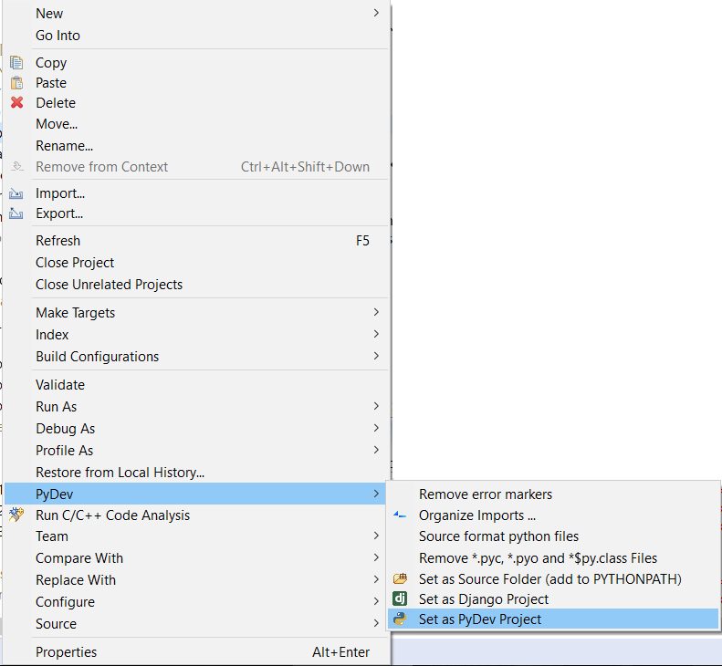

# Installation

 1. [Install Python requirements](#PythonRequirements).
 1. [Install the C development requirements](/common_pages/3.0.0/Compiler.html).
 1. [Install Java Development Kit (JDK)](http://www.oracle.com/technetwork/java/javase/downloads/index.html) - only required if modifying the Remote Access software for the Human Brain Project portal, or if you are going to use and IDE.
 1. [Install an IDE](#ide) - optional but recommended for ease of use.
 1. [Clone the git repositories](#git).
 1. [Install the python software in developer mode](#install).
 1. [Set up the C environment variables](#cenvironment).
 1. [Build the C code](#cbuild).

# <a name="PythonRequirements"></a> Python Requirements
 1. [Install the general platform requirements](/common_pages/3.0.0/PythonInstall.html)
 1. If you would prefer to use a virtualenv, [follow these instructions](/common_pages/3.0.0/VirtualEnv.html) to set up the dependencies.
 1. Install other general dependencies via pip:  
    ```pip install enum34 six "pyNN>=0.7,<0.8" "spalloc>=v0.2.2,<v1.0.0" "requests>=2.4.1" jsonschema "rig>=2.0.0,<3.0.0"```

# <a name="ide"></a> Integrated Development Environment
Although optional, we recommend the use of an Integrated Development Environment (IDE).  The code-base is large and complex and and IDE helps to simplify the development process.  Within the team at Manchester, we use two IDEs with different benefits and issues.  The installation of these is detailed below.

 * [PyCharm](https://www.jetbrains.com/pycharm/) - Version 4.5.3 has been tested but other versions should also work. This is very good for Python development and supports C development as well to some degree.  Java development is not supported in this client.  PyCharm is good at working out the links between Python code.
 
 * [Eclipse](https://eclipse.org/downloads/eclipse-packages/) - Eclipse Neon has been tested, but other versions should also work.  So far, we have been downloading the "Eclipse IDE for Java Developers" as the starting point, and then adding the packages as detailed below.  Eclipse supports development in multiple languages through the addition of plugins.  Several plugins exist for doing a wide variety of development tasks, including Python C and Java; Eclipse is the way to go if you are planning on developing in Java.  Eclipse is known to require quite a lot of memory (around 1GB just for eclipse).  Plugins required are:
    * PyDev - This is required for Python Development.  This can be installed from the Eclipse Marketplace (Help...Eclipse MarketPlace...) by searching for pydev.
    * AnyEditTools - This enables useful features like converting tabs to spaces and removing trailing spaces on save.  This can be installed from the Eclipse Marketplace (Help...Eclipse MarketPlace...) by searching for AnyEditTools.
    * CDT - This is required for C Development.  This has to be installed from the Help...Install New Software... menu option.  Here, paste in this url: CDT - http://download.eclipse.org/tools/cdt/releases/9.0.  You can then select to install "C/C++ Development Tools" as well as "C/C++ Cross Compiler Support", "C/C++ Autotools Support" and "C/C++ Hardware Debugging".
    
# <a name="git"></a> Git Cloning

The repositories to be cloned are shown below.  If you are using an IDE, it is recommended that all modules are cloned so that any changes made are automatically reflected across the entirity of the software.

|**Name**|**URL**|
|:----------------|:-----------------|
|spinnaker_tools | https://github.com/SpiNNakerManchester/spinnaker_tools.git|
|spinn_common | https://github.com/SpiNNakerManchester/spinn_common.git|
|SpiNNMachine | https://github.com/SpiNNakerManchester/SpiNNMachine.git|
|SpiNNStorageHandlers | https://github.com/SpiNNakerManchester/SpiNNStorageHandlers.git|
|PACMAN | https://github.com/SpiNNakerManchester/PACMAN.git|
|SpiNNMan | https://github.com/SpiNNakerManchester/SpiNNMan.git|
|DataSpecification | https://github.com/SpiNNakerManchester/DataSpecification.git|
|SpiNNFrontEndCommon | https://github.com/SpiNNakerManchester/SpiNNFrontEndCommon.git|
|SpiNNakerGraphFrontEnd | https://github.com/SpiNNakerManchester/SpiNNakerGraphFrontEnd.git|
|sPyNNaker | https://github.com/SpiNNakerManchester/sPyNNaker.git|
|sPyNNakerExternalDevicesPlugin | https://github.com/SpiNNakerManchester/sPyNNakerExternalDevicesPlugin.git|
|sPyNNakerExtraModelsPlugin | https://github.com/SpiNNakerManchester/sPyNNakerExtraModelsPlugin.git|
|sPyNNakerNewModelTemplate | https://github.com/SpiNNakerManchester/sPyNNakerNewModelTemplate.git|
|PyNNExamples | https://github.com/SpiNNakerManchester/PyNNExamples.git|
|IntroLab | https://github.com/SpiNNakerManchester/IntroLab.git|

## Command line

To clone using git on the command line, run:
    
    git clone <url>

where ```url``` is one of the URLs from above.  It is recommended that all modules be installed into the same directory.

## PyCharm

For each repository:

 1. Go to VCS -> Checkout from Version Control -> github
 1. In "Git Repository URL" enter the repository URL.
 1. Click Clone.
    
## Eclipse

For each repository:

 1. Go to file -> import -> git -> projects from git -> Clone URI
 1. In "URI"  enter the repository URI.
 1. Click Finish
 1. Once the repository is imported, right click and select "PyDev" --> "Set as PyDev Project".
    
   
    
# <a name="install"></a> Installing Python Modules

Installing the Python modules in developer mode allows you to use the modules from the command line.  Note that the IDEs allow you to run code directly within the IDE, and so this step is optional if you have installed and IDE.  Even when using an IDE, it can be useful to install the modules to avoid issues with the install.

For each of the python modules, go into the root directory of the module and run:
    
    [sudo] python setup.py develop --no-deps [--user]

Where ```sudo``` is required if you are on Linux or OS X and would like to install the dependencies as root (on windows you would need to open a console as Administrator); and ```--user``` is required if you would like to install the modules under your user.  Neither are required if you are using a virtualenv.

# <a name="cenvironment"></a> Set up the C environment variables

 1. Create an environment variable ```SPINN_DIRS``` that points at the location of the cloned spinnaker_tools folder (note that in Windows, this should be the MinGW Posix path e.g. if you have extracted the archive to ```C:\SpiNNaker-Tools\```, you should set the environment variable to ```/c/SpiNNaker-Tools```).
 1. Add the ```spinnaker_tools/tools``` folder to your ```PATH``` environment variable.  This does *not* need to be a POSIX path on Windows e.g. ```C:\spinnaker_tools\tools``` is fine on Windows, or ```/spinnaker_tools/tools``` on Linux or Mac.
 1. Add the ```spinnaker_tools/tools``` folder to your ```PERL5LIB``` environment variable (or create this environment variable if it is not already set; note that in Windows, this should be the MinGW Posix path e.g. if you have extracted the archive to ```C:\spinnaker_tools\```, you should set the environment variable to ```/c/spinnaker_tools/tools```).
 1. Create a new environment variable ```NEURAL_MODELLING_DIRS``` which is set to the path of the ```neural_modelling``` subfolder of the extracted archive (note that in Windows, this should be the MinGW Posix path e.g. if you have extracted the archive to ```C:\sPyNNaker\```, you should set the environment variable to ```/c/sPyNNaker/neural_modelling```).

# <a name="cbuild"></a> Build the C Code

The C code to compile is (in order) as follows:

|**Module**|**Sub Folder**|**Commands**|**Clean Command**|
|:-----|:---------|:-------|:------------|
|spinnaker_tools||```make```|```make clean```|
|spinn_common||```make```<br>```make install```|```make clean```|
|SpiNNMan|c_models|```make```|```make clean```|
|SpiNNFrontEndCommon|c_common|```make```<br>```make install```|```make clean```|
|SpiNNakerGraphFrontEnd|spinnaker_graph_front_end/examples|```make```|```make clean```|
|sPyNNaker|neural_modelling|```make```|```make clean```|
|sPyNNakerExternalDevicesPlugin|neural_modelling|```make```|```make clean```|
|sPyNNakerExtraModelsPlugin|neural_modelling|```make```|```make clean```|

A script is also available [here](automatic_make.sh) which performs the appropriate steps for you.  Note that it will clean and build everything every time it is run; this may take some time.  Note also that this assumes that you have checked out the git code into a single location.

## Building individual models
Note that in many cases, the top-level Makefile for a module may descend in to a number of sub-directories and build a number of individual models and libraries.  It is always possible to go into these subdirectories yourself and build the individual model directly.  This will save some time, since it will only build the code in the module you are interested in.  This may be necessary when debugging code.
