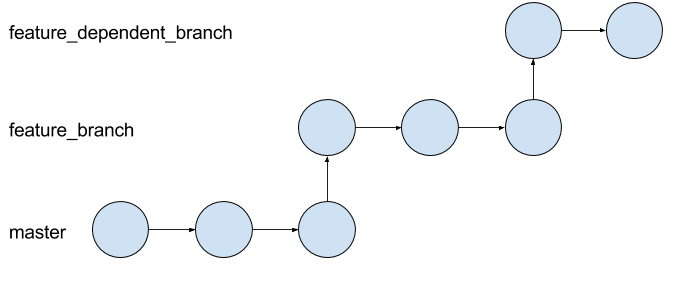
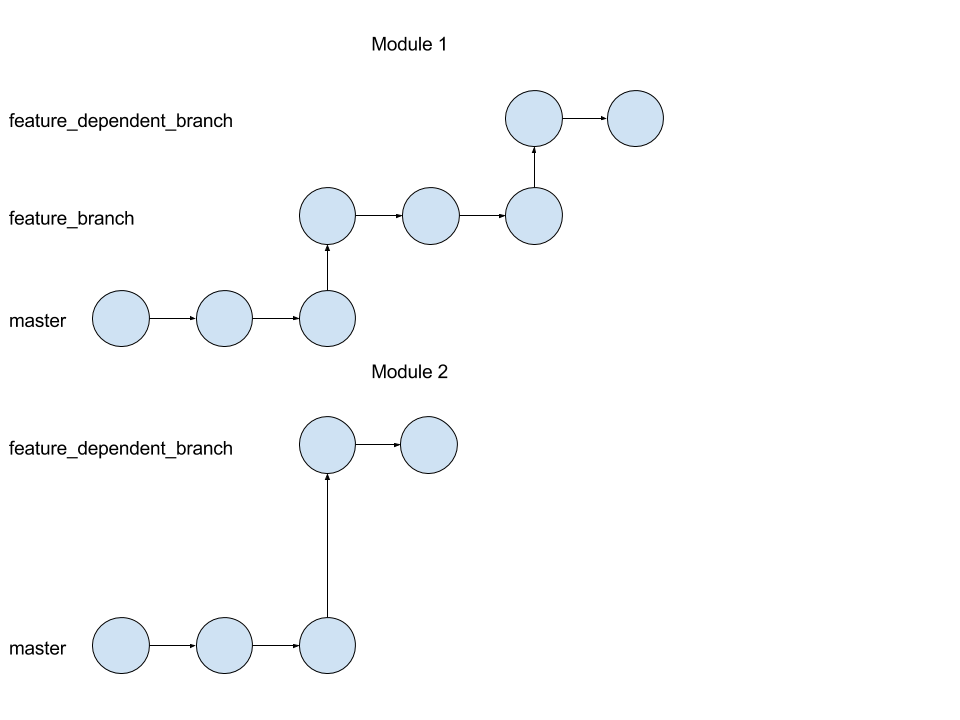
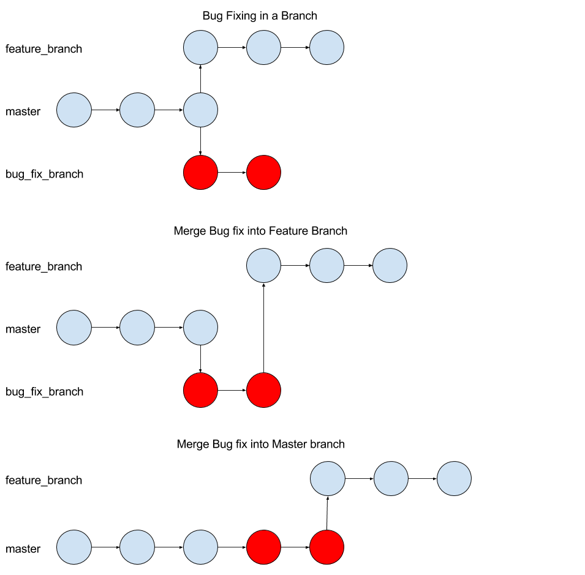
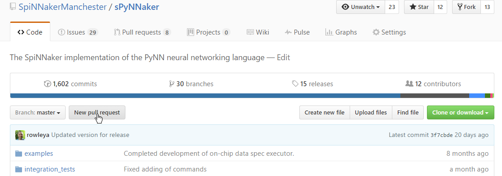
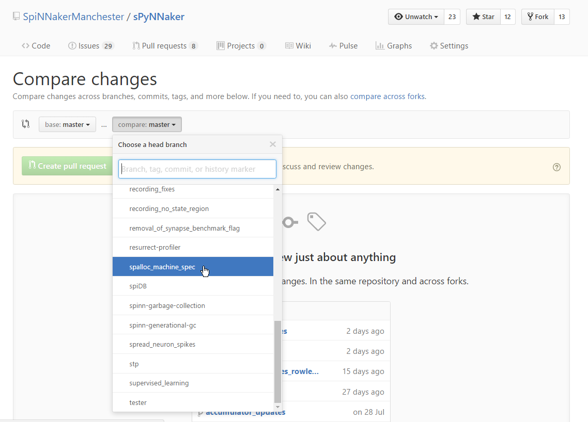
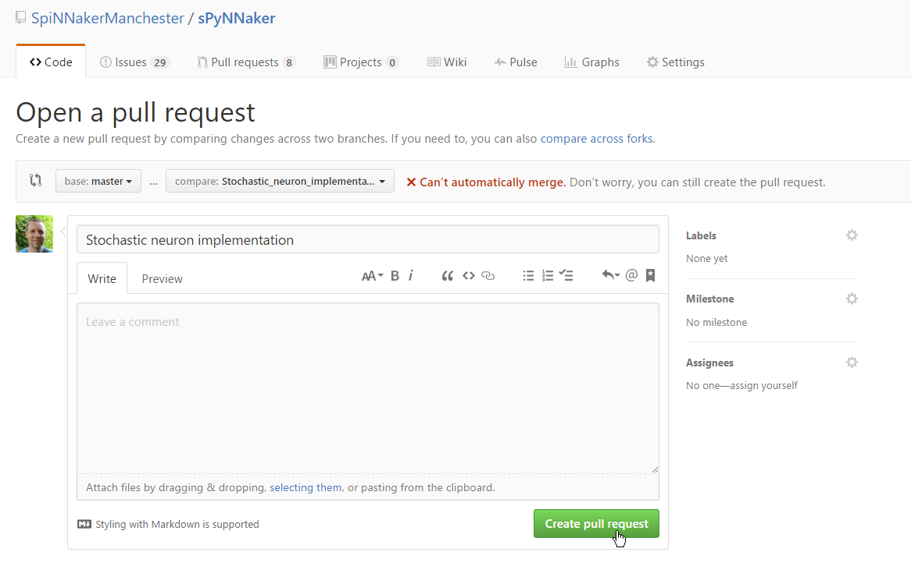

This page details some of the policies that we stick to when developing software on SpiNNaker using git and github.  This includes the use of branches and pull requests to ensure that the software is kept working.

# Git Branches
Git branches are used for the development of each feature.  If the feature requires changes to several modules, each module should have a branch with the same name as the branch in the other modules.  This makes it easier to track dependencies between branches during development.

In general, branches are made from master.  That said, it is perfectly valid to branch off a branch if a feature is dependent on changes from another feature or bug, but note that this has some implications when the code is to be merged back into master (see below).  As with any other feature branch, all modules which require changes should also be branched of the appropriate feature branch if possible; if the appropriate feature branch does not exist in the second module, the branch should be off master instead.

Git branches are also used when fixing bugs, no matter how big or small the changes are.  If you are developing a feature at the time you find a bug and the bug affects the master branch, you should commit your changes to the feature branch, and create a new branch off master (hint: it might be easier to checkout master and then do a branch).  If your work is then dependent on the bug fix, you can also merge the change into your branch, even before it has been merged in to master.  Your branch will now become dependent on the bug fix, but when this is merged into master, your branch will once again be a branch off master.

# Pull Requests
Once you have finished a feature or a bug fix (or even once you have started, to allow tracking - see below), you should open a Pull Request on GitHub for the branch containing the changes.  This will indicate that the changes are ready to be merged into master.  Before creating a pull request you should:

 1. Test that your changes don't break anything.  If there are changes that could affect other modules higher up the dependency hierarchy, these modules should be tested with your change as well to ensure that it doesn't break anything.
 1. Ensure that all functions, classes, properties and methods are documented.
 1. Ensure that all Python code meets the [PEP-8 formatting requirements](https://www.python.org/dev/peps/pep-0008/).
 1. Ensure that all C meets the [C Coding Conventions](https://users.ece.cmu.edu/~eno/coding/CCodingStandard.html)
 
A pull request is created on GitHub as follows:
 
 1. Navigate to the repository containing the code on github.com.
 1. Select the "New Pull Request" button.
    
 1. Ensure "base" is set to "master".
 1. Select the branch to be merged in the "compare" field.
    
 1. Fill in the details of the changes made.  If possible, also select the appropriate "milestone" for the feature, or else select the "bug" label if this is a bug fix.
    
 
Note that you can create a pull request before you have actually finished the changes.  In this case, the message should be formatted as a list of things still to be completed e.g.

~~~
 - [ ] Make change to code
 - [ ] Test changes don't break anything
 - [ ] Write documentation
 - [ ] Check for PEP-8 issues
 - [ ] Check against C coding conventions
~~~

This will create a series of check-boxes against your pull request, and include a progress bar on the pull request listing, which will be filled in as you tick the check boxes.  The pull request will then only be reviewed once all the boxes are checked.
