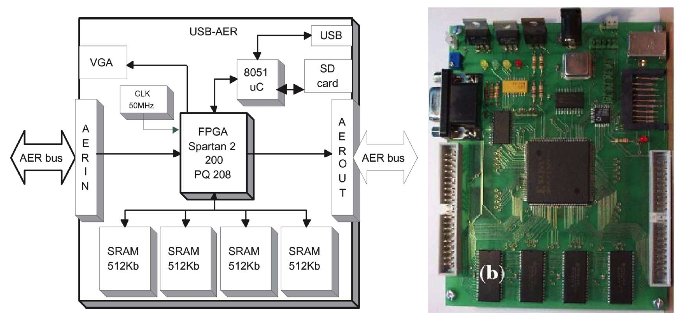
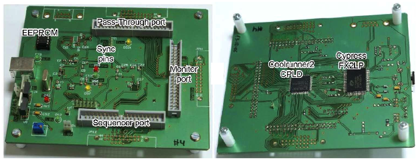
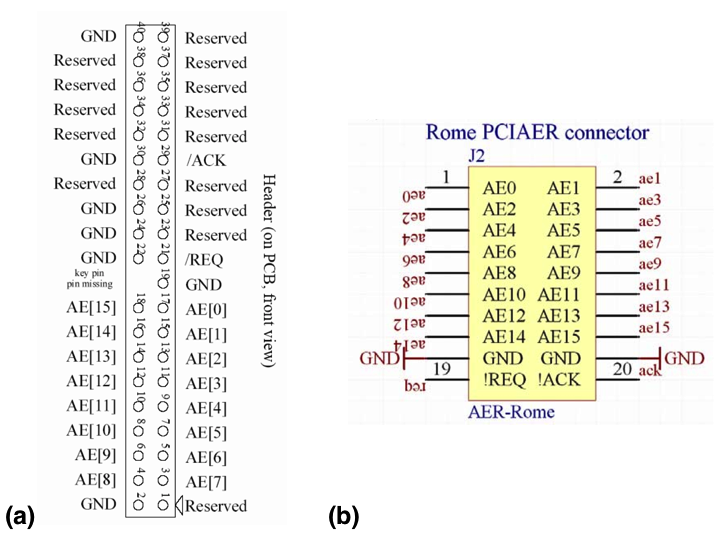
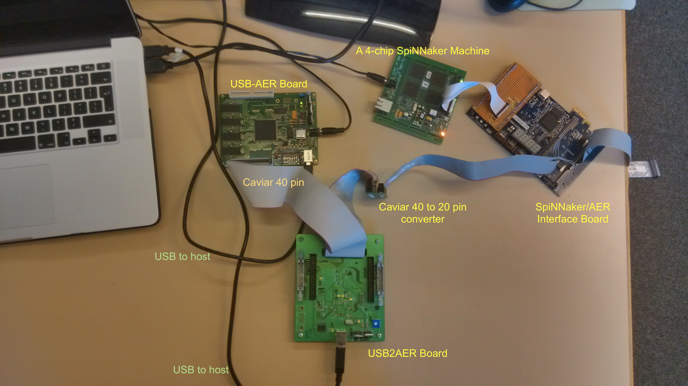
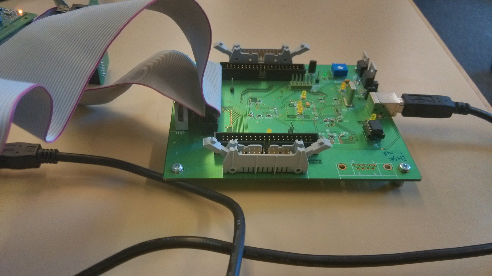
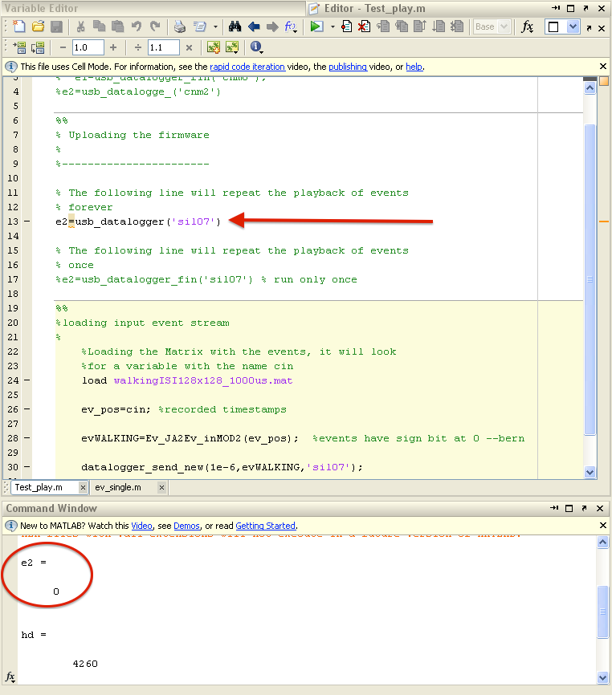
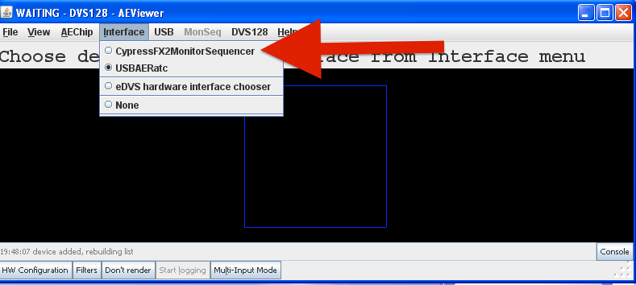
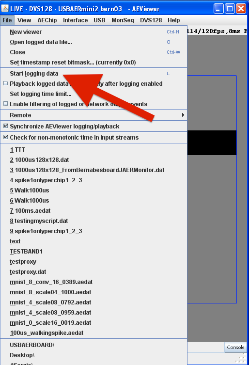
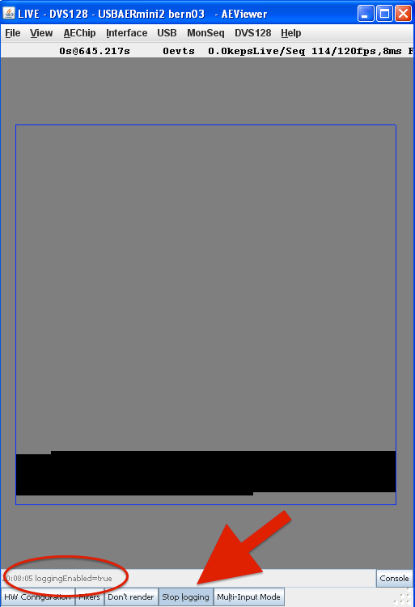

# Introduction

The purpose of this wiki is to explain how to use the USB2AER and USB-AER AER Interfaces for logging data from a neuromorphic sensor or as an artificial neuromorphic sensor connected to a Spinnaker machine. The latter has several advantages some of which are reproducible experiments and a more controlled environment for experiments.

Both USB2AER and USB-AER interfaces use a 16-bit Address Event Representation (AER) scheme for transmitting and logging events. The information of an AER packet is the source ID of the neuron that generated the action potential. 

In the following sections an explanation regarding the different hardware boards and their cabling will be given. Then a brief discussion about the required software will follow and finally an experimental setup will be demonstrated

# Hardware

Both USB2AER and USB-AER boards were developed during the [EU CAVIAR project](http://www.ini.uzh.ch/~tobi/caviar/).

## The USB-AER Board

The USB-AER (artificial spike source) uses a Spartan 2 200 FPGA chip along with a Silicon Labs C8051F320 microcontroller and depending on its firmware it can have multiple functionalities. For this wiki this board will be used for reproducing time-stamp sequences of events in real-time that were either logged from a neuromorphic sensor or were artificially generated through MATLAB. This PCB board can handle up to 25 Meps between its two AER ports and its controlled through a USB port. For a more detailed functionality of this board please refer to [1](#1). 

Figure 1 shows a photograph of the USB-AER board and its block diagram.

 
Figure 1. (a) The USB-AER PCB block diagram. (b) USB-AER PCB board 1.

## The USB2AER Board

The USB2AER board, Figure 2, is a USB2.0 Address Event Representation (AER) interface that allows simultaneous monitoring and sequencing of time-stamped events with rates up to 6 Meps [2](#2). For this wiki the aforementioned board will be used for monitoring and logging purposes through the use of the jAER software (described later in the software section).

 
Figure 2. The USB2AER Board (left: Top Face, Right: Bottom Face) board 2.

## The SpiNNaker/AER Sensor Interface

The SpiNNaker/AER sensor interface is a Raggedstone2 FPGA development board, Figure 3, that translates an AER packet from a neuromorphic sensor to a SpiNNaker Multi-cast (MC) packet and vice versa. More information on this can be found [here](/docs/fpga_aer/).

 
Figure 3. The SpiNNaker/AER Sensor Interface.

# Cabling

## AER Cabling

The AER cables are divided into two categories: The CAVIAR 40 pin 100mil double row header, Figure 4a. and the Rome 20 pin connector, figure 4b. For a detailed description of the hardware interface standards and compatibility, protocol and signal timing please refer to the CAVIAR Hardware Interface Standards, Version 2.01 [3](#3) document in the attachments section.

Some important signals include:

| __Signal Name__ | __Description__ |
| :--- | :--- |
| AER0:15 | AER data |
| /REQ | AER Request |
| /ACK | AER Acknowledge |
| GND | Ground |

More on cables and specifications [here](http://sourceforge.net/p/jaer/wiki/Cabling/)

 
Figure 4. (a) The CAVIAR 40 pin 100mil double row header, (b) The Rome 20 pin connector.

# Setup

This section provides an example setup of the boards, Figure 5. In this example the USB-AER board will be used as an artificial silicon retina and asynchronous events will flow to a SpiNNaker machine throught the SpiNNaker/AER interface board, while monitored in real-time using the USB2AER board and the jAER software. 

The Caviar 40 pin cable is connected to the OUT port of the USB-AER (Figure 6) and to the Monitor port of the USB2AER board (Figure 7). Then from Monitor port of the USB2AER board, the Caviar 40 pin cable is converted to a 20 pin Rome (Figure 8) and it's connected to the SpiNNaker/AER interface, AER IN port. 

 
Figure 5. Experimental setup of the USB-AER, USB2AER, SpiNNaker/AER Interface board and a 4-chip SpiNNaker machine.

| --- | --- |
|  Figure 6. USB-AER connectivity close up. The Caviar 40 pin cable connects to the AER OUT port. |   Figure 7. USB2AER connectivity close up. The Caviar 40 pin cable connects to the Monitor port. |
|   Figure 8. Caviar 40 to 20 pin (ROME) converter. | |

# Software

This section describes the software required for the configuration shown in Figure 5. Section 5.1 describes the requirements, drivers, and software required to upload the time-stamped events to the USB-AER board. In a similar way, Section 5.2 explains how to use USB2AER board along with the jAER software to monitor and log incoming events in real-time. Everything was tested on a Virtual Machine (VMWare) running Windows XP 32-bit Service Pack 3.

## Software for the USB-AER Board

### Driver

This device is programmed through MATLAB and the driver will only work with Windows XP 32-bit and MATLAB version R2012a (7.14.0.739), 32-bit (win32). The driver is located in the USBAERBOARD\Driver directory (attachments section). 

### MATLAB Format for the time-stamped events

This section explains the MATLAB Format for the artificially generated time-stamped events. An example is presented in the following table: 

| __Time-stamp (uS)__ | __?__ | __?__ | __X__ | __Y__ | __Polarity (-1 or 1)__ |
| --- | --- | --- | --- | --- | --- |
| 0 | 0 | -1 | 0 | 0 | 1 |
| ... | ... | ... | ... | ... | ... |
| 2000 | 0 | -1 | 1 | 20 | 1 |

The first column represents the timing of that event in microseconds, 2nd and 3rd column not known always set to 0 and -1, 4th column is the X address of the event, 5th column is the Y address of the event and finally the 6th column represents the polarity, set 1 for ON events and -1 for OFF events. The walkingISI128x128_1000us.mat file has an example matrix (cin) that simulates the population of a silicon retina with a size set to 128x128 and with every other neuron sending an event at 1,000 uS intervals starting from X=0, Y=0 (polarity set to ON). 

### MATLAB 

Test_play.m file is a template is provided for MATLAB.  There are two functions used to upload the firmware to the USB-AER board. The usb_datalogger() and the usb_datalogger_fin(), both receive a string with the board's name as an argument. The only difference is that the latter one will stop sending events when all events have been send, while the first one will restart the process. In the Test_play.m file, line 13 the usb_datalogger('sil7') is used. Both functions return an error code; if 0 the uploading process was successful, Figure 9.

 
 
Figure 9. Uploading firmware to the USB-AER board using the usb_datalogger() function. The bottom part of the figure shows the return code indicating that the uploading process was successful.

The matrix with the time-stamped events are passed as an argument to the Ev_JA2Ev_inMOD2() function using the format as shown in section 5.1.2. The Test_play.m file will load the walkingISI128x128_1000us.mat, which has an example matrix (cin) that simulates the population of a silicon retina with a size set to 128x128 and with every other neuron sending an event at 1,000 uS intervals starting from X=0, Y=0 (polarity set to ON). 

## Software for the USB2AER Board

### jAER

jAER is an open source Java software designed for real-time event-driven processing and monitoring on PCs. For this wiki jAER will be used for monitoring time-stamped AER events coming from the USB2AER board. For more detailed information regarding the jAER software please refer to:
[http://sourceforge.net/p/jaer/wiki/About%20jAER/](http://sourceforge.net/p/jaer/wiki/About%20jAER/)

### USB2AER Driver

### Monitoring and logging events with jAER and the USB2AER board

Verify that the USB2AER board is connected to the host, then run jAER and choose from the drop-down menus Interface/CypressFX2MonitorSequencer, as seen in Figure 10. Figures 11 & 12 show how to start and stop logging data.

 
Figure 10. Change the jAER interface to CypressFX2MonitorSequencer to monitor the events coming from the USB-AER board in real-time.

| --- | --- |
|   Figure 11. Start logging data. |   Figure 12. Stop logging data. | 

## Software for SpiNNaker

Any of the pyNN examples related to a silicon retina, check polarities.

# Attachments

1. [USBAERBOARD.zip](USBAERBOARD.zip) - Includes the driver, MATLAB functions and templates for the USB-AER Board.
1. [AER_Hardware_and_cabling.pdf](AER_Hardware_and_cabling.pdf) - AER hardware and cabling.
1. [Consortiumstandards.pdf](Consortiumstandards.pdf) - Caviar hardware interface standards.

# References

[1] Serrano-Gotarredona, R.; Oster, M.; Lichtsteiner, P.; Linares-Barranco, A; Paz-Vicente, R.; Gomez-Rodriguez, F.; Camunas-Mesa, L.; Berner, R.; Rivas-Perez, M.; Delbruck, T.; Shih-Chii Liu; Douglas, R.; Hafliger, P.; Jimenez-Moreno, G.; Ballcels, AC.; Serrano-Gotarredona, T.; Acosta-Jimenez, AJ.; Linares-Barranco, B., "CAVIAR: A 45k Neuron, 5M Synapse, 12G Connects/s AER Hardware Sensory-Processing-Learning-Actuating System for High-Speed Visual Object Recognition and Tracking," Neural Networks, IEEE Transactions on , vol.20, no.9, pp.1417,1438, Sept. 2009
doi: 10.1109/TNN.2009.2023653

[2] Berner, R.; Delbruck, T.; Civit-Balcells, A; Linares-Barranco, A, "A 5 Meps $100 USB2.0 Address-Event Monitor-Sequencer Interface," Circuits and Systems, 2007. ISCAS 2007. IEEE International Symposium on , vol., no., pp.2451,2454, 27-30 May 2007
doi: 10.1109/ISCAS.2007.378616

[3] P. Hafliger, "CAVIAR Hardware Interface Standards, Version 2.01", March 2004, [http://heim.ifi.uio.no/~hafliger/CAVIAR/Consortiumstandards.pdf](http://heim.ifi.uio.no/~hafliger/CAVIAR/Consortiumstandards.pdf)
