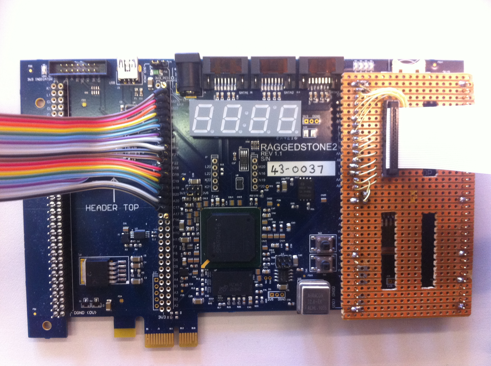
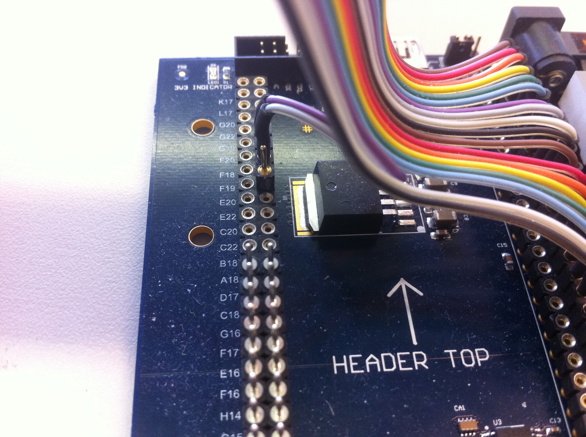
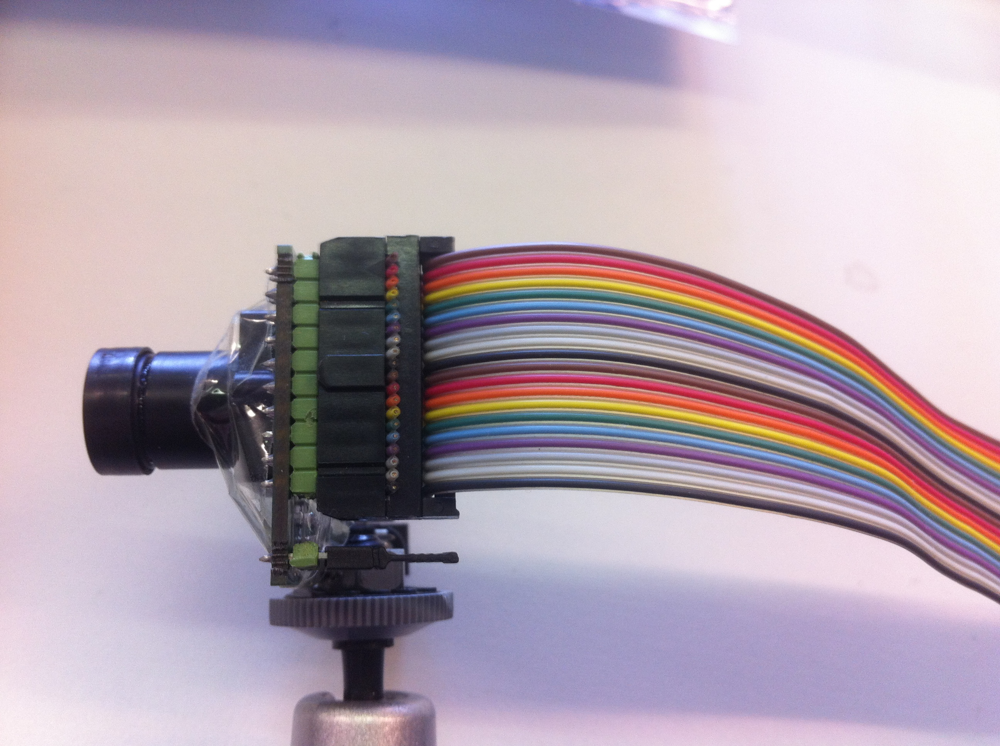
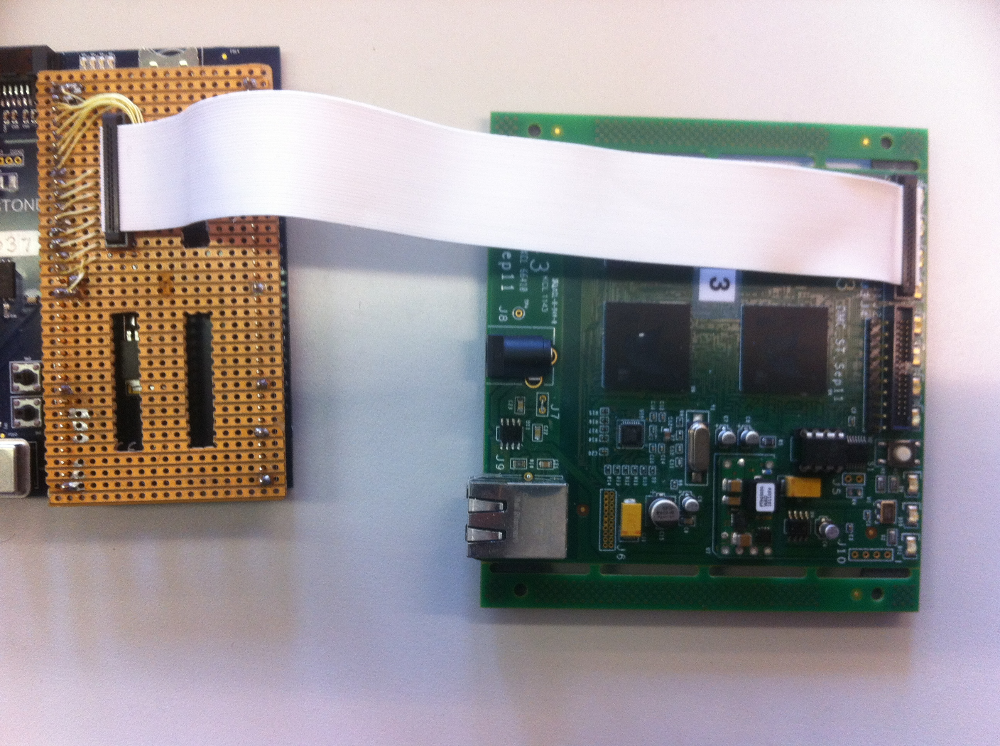
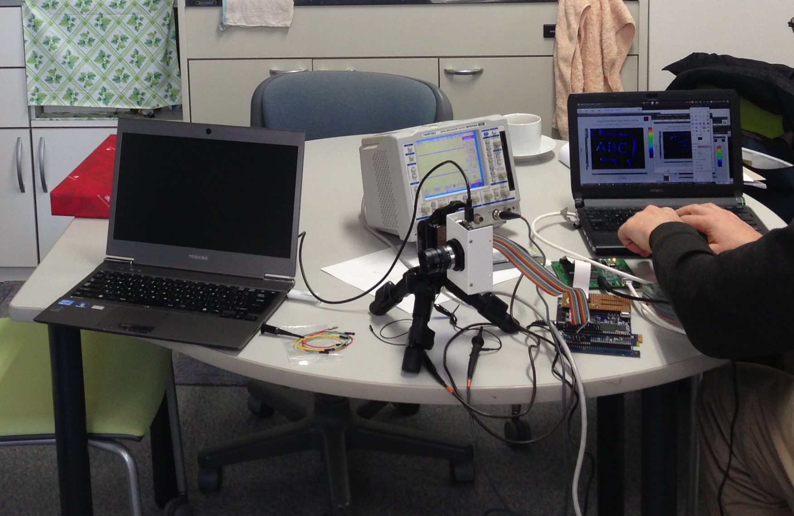
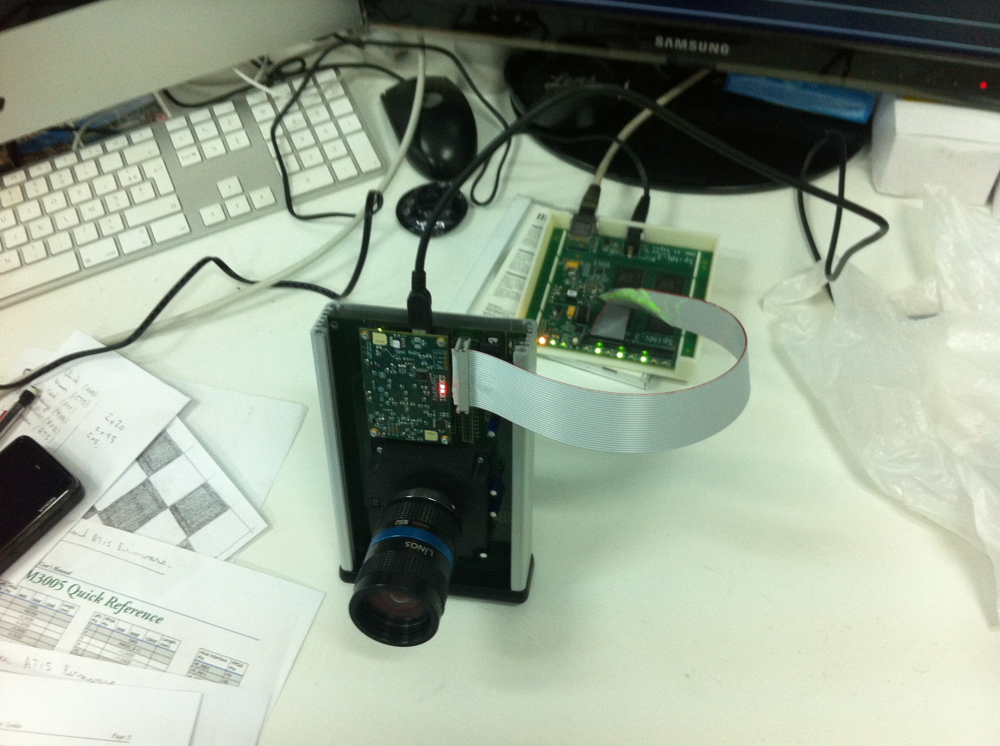

# Introduction

This wiki page contains a collection of resources needed to interface AER sensors with SpiNNaker through a bidirectional inter-chip SpiNNaker link using an FPGA.
 

# Resources
[This application note](/docs/spinn-app-8.pdf) describes the implementation of an interface between Address-Event Representation (AER) devices and the SpiNNaker system using an FPGA.

[This document](AER Hardware and cabling-1.pdf) describes the cabling and protocol for AER boards.

## verilog code
The example verilog code related to the application note can be found below:

 * [spinn_aer2_if.tgz](spinn_aer2_if.tgz) - Example Verilog code for bidirectional interface between SpiNNaker and AER devices using an FPGA
 * [spinn_aer_if.v](spinn_aer_if.v) - Example Verilog file for interfacing AER sensors with SpiNNaker using an FPGA 

# Example setups
 
## Interface with DVS - Instituto de Microelectronica, Universidad de Sevilla - using a RaggedStone2 FPGA board

 
 
 
 
<iframe width="560" height="315" src="https://www.youtube.com/embed/WKzUbFoYO4Y" frameborder="0" allowfullscreen></iframe>

## Prototype interface with DVS - University of Osaka

 
<video controls="controls" style="width: 600px" src="Osaka_SpiNNAker_if.mov">
[Setup demonstration video](Osaka_SpiNNAker_if.mov)
</video>

## Prototype Interface with the ATIS - Institut de La Vision, Paris

 

