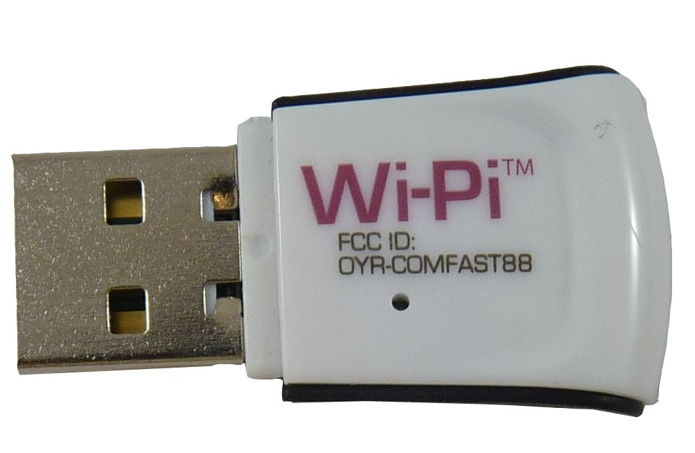

# The Robot

# The wifi connector for the SpiNNaker machine

To use the SpiNNaker board wifi adaptor, you must first plug the usb connection into something to provide it with power.

# The wifi access point that is used to relay between the push bot and either a host machine or the wifi connector.

The PushBot is a robotic platform developed by [Technische Universität München](http://www.ei.tum.de/en/research/coc-neuro-engineering/).

# Hardware Overview

## Robot Features

  * 2 tracks, each controlled by 2 wheels.
  * A silicon retina.
  * A laser.
  * A LED.

## Control Systems

The robot can be connected to a SpiNNaker machine through 2 interfaces.
    * It can go through the SpiNNaker link connector via the WiFi connector provided above.
    * It can be connected to SpiNNaker via the access point (shown above) indirectly via a host machine and using the SpiNNaker Software Stack.

# SpiNNaker-Facing API

The API for the robot has changed and is now defined in the following google document:

[https://docs.google.com/document/d/1lJ2t5ISbdJpgHs7oGCI9pG10y2xzKz2hoclRX5WocLM/pub](https://docs.google.com/document/d/1lJ2t5ISbdJpgHs7oGCI9pG10y2xzKz2hoclRX5WocLM/pub)

(Alternatively, a copy was made on 22-09-14 in the event that the above link should die: [http://pastebin.com/HC5GPs0n](http://pastebin.com/HC5GPs0n))

## Charging

The robot has 4 AA batteries which are located below:

There is a provided battery charger as shown below:

## Wifi Access Point

The robot's wifi interface consists of a WiFi access point to which the pushbot communicates with regardless of the connection type for SpiNNaker. The network details are below. But for simplicity, the password to log into the access point is rpo45trkrfgpoloektr45poael

2.4 GHz

	SSID: NSTrobots_2.4GHz
	wireless mode: b/g/n mixed
	b/g Protection: auto
	channel bandwidth: 20/40 MHz
	channel: auto
	extension channel: above
	authentication method: wpa2-personal
	wpa encryption: aes
	wpa key: rpo45trkrfgpoloektr45poael
	network key rotation level: 3600
	tx power adjustment: 100
	region code: europe (channels 1-13)

	Guest AP: off
	Bridge: AP only, Channel auto
	Wireless MAC filter: empty
	Radius Setting: empty

5.0 GHz

	SSID: NSTrobots_5GHz
	mode: a/n
	rest see above

LAN
	IP: 10.162.177.1
	Subnet: 255.255.255.0

	DHCP Server
		Domain Name: tu-muenchen.de
		IP Pool Start: 10.162.177.175
		IP Pool End: 10.162.177.249
		Lease Time: 86400
		Default GW: 10.162.177.254therobot

		DNS 1: 10.156.33.53
		DNS 2: 129.187.5.1

		Manual Assignment:
			00:23:A7:01:04:89	10.162.177.20	RedPineMiniSPI00
			00:23:A7:01:08:2E	10.162.177.21	RedPineMiniSPI01
			00:23:A7:01:08:17	10.162.177.22	RedPineMiniSPI02
			00:23:A7:1B:C7:D9	10.162.177.30	RedPineSPIEval
			00:23:A7:1B:C9:77	10.162.177.31	RedPineSPI01
			00:23:A7:1B:C9:34	10.162.177.32	RedPineSPI02
			00:23:A7:1D:C7:8E	10.162.177.40	RedPineSmall00
			00:23:A7:1D:88:EB	10.162.177.41	RedPineSmall01
			00:23:A7:1F:0E:FD	10.162.177.42	RedPineSmall02
			00:23:A7:1D:8B:27	10.162.177.43	RedPineSmallSPI03
			00:23:A7:1D:5B:60	10.162.177.44	RedPineSmallSPI04
			00:23:A7:1D:8A:8E	10.162.177.45	RedPineSmallSPI05
			00:23:A7:1D:5A:E7	10.162.177.50	OmniRob7-ROB-TOP
			00:23:A7:1B:C7:94	10.162.177.51	OmniRob7-000
			00:23:A7:1D:8A:95	10.162.177.53	OmniRob7-120
			00:23:A7:1D:5A:F5	10.162.177.55	OmniRob7-240
			00:01:36:1D:D7:13	10.162.177.60	Rovio00
			00:01:36:22:84:74	10.162.177.61	Rovio01
			00:23:A7:1D:58:4A	10.162.177.62	OmniRob62
			00:23:A7:1D:5A:DB	10.162.177.63	OmniRob63
			00:23:A7:1F:0F:94	10.162.177.64	OmniRob64
			00:23:A7:1D:36:9C	10.162.177.65	OmniRob65
			00:23:A7:1D:36:80	10.162.177.66	OmniRob66
			00:23:A7:00:14:11	10.162.177.130	RedPine5GHzSPI0
			00:23:A7:00:9C:B1	10.162.177.131	RedPine5GHzSPI1
			00:23:A7:00:14:1D	10.162.177.132	RedPine5GHzSPI2
			00:23:A7:00:9B:C9	10.162.177.133	RedPine5GHzSPI3
			00:23:A7:00:14:13	10.162.177.134	RedPine5GHzSPI4
			00:23:A7:00:9C:A7	10.162.177.135	RedPine5GHzSPI5
			00:23:A7:00:9B:D2	10.162.177.136	RedPine5GHzSPI6
			00:23:A7:00:9A:30	10.162.177.137	RedPine5GHzSPI7
			00:23:A7:00:9B:4A	10.162.177.138	RedPine5GHzSPI8
			4C:E6:76:F7:DE:35	10.162.177.59	SpOmniBot

	Route
		use dhcp routes: yes
		enable static routes: yes
		static routes:
			0.0.0.0	0.0.0.0	10.162.177.254	303	LAN

	IPTV
		off

Firewall
	Disabled

Login
	nst/nst

## robot ip addresses

The IP of the pushbot is 10.162.177.XXXXX where XXXXX is the number of the red circle at the back of the push bot. As shown below, where the IP would by 10.162.177.57.
The IP of the SpiNNaker link wifi board is 10.162.177.56

If you are using a desktop machine and the host configuration, you will need a wifi adaptor, as shown below, to connect to the wifi access point. These can be acquired from central services through the website http://studentnet.cs.manchester.ac.uk/ugt/hardware. The systemw as originally tested with the WiPi adaptor from there.

If you are using a remote profile supported by centeral services, you need to be careful with your configuration to stop your wifi adaptor overwriting your ethernet gateway address. The best option we have found is to plug in a switch between your machine and the ethernet socket, and then wire that to the wifi access point and then do the following commands.

    sudo ip addr add 10.162.177.254/24 dev eth0
    sudo ip addr add 192.168.240.254/16 dev eth0

## Setting your uni machine to communicate with generic 4 chip boards.

If on ubuntu machines, open a command terminal and enter the following commands.

    sudo ip addr add 192.168.240.254/16 dev eth0
    ifconfig

if this is successful, you should be able to ping the standard 4 chip board that communicates on ip address 192.168.240.253

## connection order for the spinnaker link based protocol to behave

connect the SpiNNaker wifi connector to the 0 SpiNNaker link where the board is hovering over the SpiNNaker chips (as shown below). Be careful to align the pins correctly, otherwise you shall find it wont respond at all

<left>

</left>

<right>

</right>

It seems to be a issue that if the components are not connected and powered in a specific order, then communication fails. The successful connection order is below:

1. turn off:
    1. spinnaker board
    2. wifi adaptor power (usb thing)
    3. push bot

2. turn on push bot and wait for it to connect to wifi (flashing green light) and then ping to verify you can communicate with it
3. turn on wifi module (put in usb) wait for flashing green light. ping to verify you can talk to it
4. turn on spinnaker board,
5. run script.
