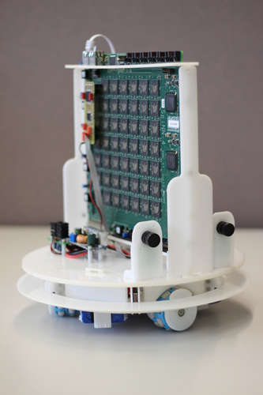
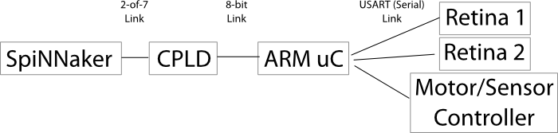

# The Robot

The SpOmnibot is a robotic platform developed by [Technische Universität München](http://www.ei.tum.de/en/research/coc-neuro-engineering/). You can read more about this in the paper "Real-Time Interface Board for Closed-Loop Robotic Tasks on the SpiNNaker Neural Computing System" (Christian Denk, Francisco Llobet-Blandino, Francesco Galluppi, Luis A. Plana, Steve Furber, Jörg Conradt) in Artificial Neural Networks and Machine Learning ICANN 2013.

# Hardware Overview

## Robot Features

 * Three omniwheels driven by DC(?) motors
 * Encoders to detect wheel rotation for each motor
 * Multi-point bump-sensor
 * Two silicon retinas
 * SpiNNaker board mount
 * Separate batteries for the robot and for SpiNNaker
 * TODO: and some other things...

## Control Systems

The robot is connected to the SpiNNaker board via a spinnaker 2-of-7 asynchronous link connected to the otherwise unused South-west link on chip (0,0).

The robot is controlled by a small SpiNNaker interface board which contains a CPLD and an ARM microcontroller. The CPLD essentially translates between the 2-of-7 signaling used by SpiNNaker and a simple 9-bit binary interface (8 bits of data with extra signals for end-of-packet, req and ack) used by the microcontroller.

The microcontroller communicates with the retinas and the robot's motor controllers and other sensors via serial connections and exposes these peripherals via a multicast packet interface.

Here is a very crude picture:

# SpiNNaker-Facing API

The API for the robot has changed and is now defined in the following google document:

[https://docs.google.com/document/d/1lJ2t5ISbdJpgHs7oGCI9pG10y2xzKz2hoclRX5WocLM/pub](https://docs.google.com/document/d/1lJ2t5ISbdJpgHs7oGCI9pG10y2xzKz2hoclRX5WocLM/pub)

(Alternatively, a copy was made on 22-09-14 in the event that the above link should die: [http://pastebin.com/HC5GPs0n](http://pastebin.com/HC5GPs0n))

## Charging

The robot has two sets of batteries:

1. Omnibot motors:
   - LiPo charging mode, 2 cells in series 7.4V (2~3 hours).
   - use 2xbanana to "power" plug cable.
   - connect red/black banana plugs in charger output sockets.
   - connect "power" plug to socket next to robot power switch.

2. SpiNNaker board:
   - LiPo balanced mode, 3 cells in series 11.1V (10~12 hours).
   - use (2xbanana + 4-pin plug) to 6-pin plug cable.
   - connect red/black banana plugs in charger output sockets.
   - connect 4-pin balance plug in 3-cell balance charging socket.
   - connect 6-pin plug to small board on robot, next to large batteries.

## Wifi Access Point

The robot's wifi interface consists of a WiFi access point to which the SpiNNaker board is attached via Ethernet. The network details are as follows:

SSID: NSTrobots1
pass: robospinn

The IP of the SpiNNaker board is 172.16.1.2. The access point will assign your machine an IP in the same network upon connection (172.16.1.x).

## Attachments

 * [robotSpiNNakerInterfaceBoard.zip](robotSpiNNakerInterfaceBoard.zip) - Source code for the SpiNNakerRobot Microcontroller Interface
 * [main.jed](main.jed) - programming file for the cpld on the interface board
 * [spomnibot_cpld_code.tgz](spomnibot_cpld_code.tgz) - Source code for the cpld on the interface board
 * [spinInterface.axf.zip](spinInterface.axf.zip) - binary code for the uC interface
 * [omnibot.h](omnibot.h) -	MC based communication protocol
 * [SpinLink34-RobotIO.pdf](SpinLink34-RobotIO.pdf) - uC board schematics
