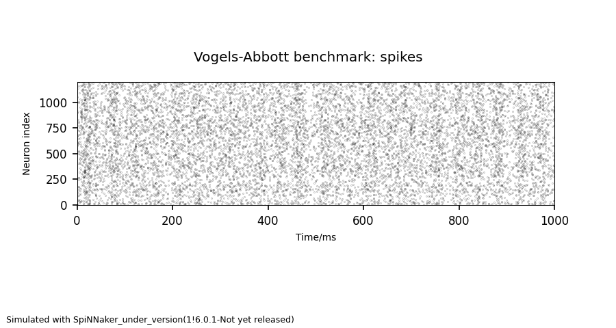

This guide details how to install the release version of the tools required to run simulations on SpiNNaker using the PyNN scripting language, if you have a local SpiNNaker machine.  If you wish to run jobs on the million-core SpiNNaker machine in Manchester, then we suggest you use our [Jupyter Notebook](/latest/jupyter.md) instructions, or submit jobs via the [HBP Portal](/latest/hbp_portal.md) instead.

# Installation

You must first install the [Python Dependencies](/common_pages/6.0.0/PythonInstall.html).  Continue to the [Virtualenv Installation](#Virtualenv), [Central Installation](#Central),  or [User-only Installation](#User) to install the remaining requirements, depending on the needs of your working environment.  If you are unsure what to choose, the option that will most likely work is the [Virtualenv Installation](#Virtualenv).

__Note__: sPyNNakerExternalDevicesPlugin, sPyNNakerExtraModelsPlugin and sPyNNaker8 are no longer required.  These extra modules have been merged in to the main sPyNNaker module.  You will be asked to uninstall these modules below if you have previously installed them, but will note that there are no instructions for installing a newer version.

* [Python Dependencies](/common_pages/6.0.0/PythonInstall.html)
* [Virtualenv Installation](#Virtualenv)
* [Standard Central Installation](#Central)
* [User-Only Installation](#User)
* [Configuration](#Configuration)
* [Running some examples](#Examples)
* [Troubleshooting](#Trouble)

# <a name="Virtualenv"></a> Virtualenv Installation

Follow [these instructions](/common_pages/6.0.0/VirtualEnv.html) to install the dependencies in a virtual environment.

If you already have installed sPyNNaker previously (and the optional sPyNNakerExternalDevicesPlugin and/or sPyNNakerExtraModelsPlugin), you will need to uninstall it:

1. Activate your virtualenv, `<name>`

       source <name>/bin/activate

1. Uninstall the existing tools (if previously installed)

       pip uninstall pyNN-SpiNNaker
       pip uninstall sPyNNaker
       pip uninstall sPyNNaker8
       pip uninstall sPyNNakerExternalDevicesPlugin
       pip uninstall sPyNNakerExtraModelsPlugin

To install the tools, first, activate your virtualenv, `<name>`:

    source <name>/bin/activate

1. Install Matplotlib:

       pip install matplotlib

1. Install sPyNNaker(8):

       pip install sPyNNaker

1. Install pyNN-SpiNNaker(8):

       python -m spynnaker8.setup_pynn

You can now [configure](#Configuration) your environment.


# <a name="Central"></a> Central Installation
These instructions will install the required packages in a central location.  If you are installing on Linux, you must have root access to do this (or prepend each command with `sudo`), and Windows users should run these commands from a command prompt run as Administrator (right-click the shortcut for the command prompt and select "Run as administrator", but do not use the `sudo` in the commands below).

If you already have installed sPyNNaker previously (and the optional sPyNNakerExternalDevicesPlugin and/or sPyNNakerExtraModelsPlugin), you will need to uninstall it:

    [sudo] pip uninstall pyNN-SpiNNaker
    [sudo] pip uninstall sPyNNaker
    [sudo] pip uninstall sPyNNaker8
    [sudo] pip uninstall sPyNNakerExternalDevicesPlugin
    [sudo] pip uninstall sPyNNakerExtraModelsPlugin

1. Install Matplotlib:

       [sudo] pip install matplotlib

1. Install sPyNNaker:

       [sudo] pip install sPyNNaker

1. Install pyNN-SpiNNaker:

       [sudo] python -m spynnaker8.setup_pynn

You can now [configure](#Configuration) your environment.

# <a name="User"></a> User-only Installation

These instructions will install the required packages only for the current user (in your home directory).  This can avoid issues where you don't have root access to the machine you are installing on, or on a shared machine where the dependencies might otherwise conflict with those of other users.

If you already have installed sPyNNaker previously (and the optional sPyNNakerExternalDevicesPlugin and/or sPyNNakerExtraModelsPlugin), you will need to uninstall it:

    pip uninstall pyNN-SpiNNaker
    pip uninstall sPyNNaker
    pip uninstall sPyNNaker8
    pip uninstall sPyNNakerExternalDevicesPlugin
    pip uninstall sPyNNakerExtraModelsPlugin

1. Install Matplotlib:

       pip install matplotlib --user

1. Install sPyNNaker:

       pip install sPyNNaker --user


1. Install pyNN-SpiNNaker:

       python -m spynnaker8.setup_pynn

You can now [configure](#Configuration) your environment.


# <a name="Configuration"></a> Configuration

When SpyNNaker is first called, if a configuration file is not found, it will create one in your home directory and exit.  It is possible to ask sPyNNaker to do this before you run your first simulation as follows:

Run this small script

    import pyNN.spiNNaker as sim
    sim.setup()
    sim.end()

Unless one already exists a new file called ".spynnaker.cfg" will be created in your home directory.  You must edit this file to ensure that sPyNNaker can access your SpiNNaker machine.  Upon opening this file, the part to alter will look like the following:

```
[Machine]
machineName = None
version = None
```

If you have a SpiNNaker board, then go to [Local Board](#LocalBoard).

If you do not have a SpiNNaker board, then you have two options:

1) If you can directly access a local machine that uses spalloc (for example, you are in Manchester and wish to use the million-core machine), then you need to set the following parameters in the ".spynnaker.cfg" you just created (e.g.):

```
[Machine]
spalloc_server = spinnaker.cs.man.ac.uk
spalloc_user = user.name@email.address
```

where you edit spalloc_server if you are using a different spalloc_server; editing spalloc_user is helpful for administrators of the machine to contact you if there are any problems, which is why we suggest using an email address.

OR 2) To run in virtual mode, please follow the instructions in [Instructions on how to use the different front ends in virtual mode](/common_pages/6.0.0/VirtualMode.html) and then go to [Running some examples](#Examples).

## <a name="LocalBoard"></a> Local Board

Within the file, you should set `machineName` to the IP address or hostname of your SpiNNaker machine, and `version` to the version of your SpiNNaker board; this will almost certainly be "`3`" for a 4-chip board or "`5`" on a 48-chip board. The default IP address for a spinn-3 board is `192.168.240.253` and the default IP address for a spinn-5 board is `192.168.240.1`.

Now go to [Network Configuration](#NetworkConfiguration).

## <a name="NetworkConfiguration"></a> Network Configuration

Go to the network settings for your computer and add or set an IPv4 entry with the following address for the adapter connected to the SpiNNaker board:

 1. IP address = `192.168.240.254`
 2. sub-mask = `255.255.255.0`
 3. default gateway = `0.0.0.0`

# <a name="Examples"></a> Running some examples
1. Download the examples:

    * __PyNN 0.9 Examples__ are [here](https://github.com/SpiNNakerManchester/PyNN8Examples/archive/refs/tags/Spinnaker6.0.0.zip) (zip) or [here](https://github.com/SpiNNakerManchester/PyNN8Examples/archive/refs/tags/Spinnaker6.0.0.tar.gz) (tar.gz)

1. Extract the archive
1. Go to the "examples" folder
1. Run:

       python va_benchmark.py

1. You will see the system go through a series of processes from partitioning, to placement, to routing and finally to loading and running.
1. Once the example has finished, you should see a graph that will look something like this:

   

If you get the output above, you have successfully installed your system.

# <a name="Trouble"></a> Troubleshooting

<!--
1. If on Windows you experience the error:

       **UnicodeDecodeError: 'ascii' codec can't decode byte 0xb0 in position 1: ordinal not in range(128)**

   Then to solve it, edit `C:\Python27\Lib\mimetypes.py` and add these codes:

   ```python
   if sys.getdefaultencoding() != 'gbk':
       reload(sys)
       sys.setdefaultencoding('gbk')
   ```

   before the following line:

   ```python
   default_encoding = sys.getdefaultencoding()
   ```
-->
1. In OSX, if experiencing the following tkinter error:

       _tkinter.TclError: no display name and no $DISPLAY environment variable

    it may be solved by setting the backend for matplotlib. This can be done by editing the matplotlibrc file in the current working directory to read to ```backend: TkAgg```. This is usually found in `$DEV/lib/pythonXXX/site-packages/matplotlib/mpl-data/matplotlibrc`

    In a virtualenv, create a new file in the root directory ```.matplotlib/matplotlibrc``` that reads ```backend: TkAgg```. ([Sample matplotlibrc file](https://matplotlib.org/_static/matplotlibrc))

    If you are still having issues, you may also need to install [XQuartz](https://www.xquartz.org/).

2. In OSX, if you have problems during the installation of the `csa` package (a dependency of sPyNNaker; this problem cascades outwards) within your virtualenv, then use:

        MPLBACKEND=module://matplotlib.backends.backend_agg pip install sPyNNaker --user

    This overrides the matplotlib plotting backend _just during the installation phase,_ which is sufficient to get a working installation if you are not actively using matplotlib to do immediate plotting of the data.

# <a name="Links"></a> Other Links

Follow [SpiNNaker Extensions](PyNNOnSpiNNakerExtensions.html) to install extensions for building new neuron models.

