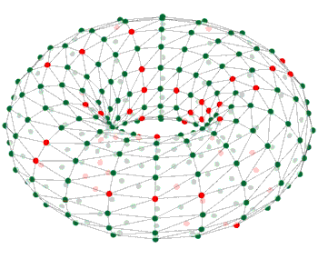

# School of Computer Science, Manchester, UK, 9th-13th September, 2019

The workshop will focus using SpiNNaker in robotics; including but not limited to presentations on:

 - Introduction to SpiNNaker hardware & software
 - Specifying networks in PyNN 0.9
 - Using the HBP portal
 - Simple data I/O and visualisation
 - Connecting external devices to SpiNNaker
 - Adding new neuron & synapse models & learning rules

The workshop consists of presentations by the software team and other SpiNNaker users (mainly from the field of robotics) as well as hands-on labs with SpiNNaker hardware. There will be time to discuss your own project plans and issues with the design team during the week.

Attendees should have some prior experience with Python. For the topics on new neuron models and learning rules, some background in C is highly recommended.

See the [timetable](robotics2019.html).

# Slides

1. [Access to SpiNNaker](https://drive.google.com/open?id=15XWZL-aAIJlN-Ixa_uJuEjxjqnn3yvarXBkWiHcWv_E)
1. [External Devices](https://drive.google.com/open?id=1h_4mbXPbEOpZ92ZU876q7op30libvgSnhJiF7mHOAvM)
1. [SNNs on SpiNNaker](https://drive.google.com/open?id=1Fb41D0udoxGfWWDz_ADRAsswqeW3GZTI7E42ZyeGYjQ)
1. [Neuron Models and Learning](https://drive.google.com/open?id=1YjucTHMAjnLI8fJTyAUE2pyBpaElxgev)
1. [SpiNNaker and the NRP](https://drive.google.com/open?id=1yhynahDRmX9RbCrwfWaPPCYSXXsbtKLiIvDaVM_0cls)

# Lab Manuals

1. [Intro Lab](/spynnaker/5.0.0/IntroLab-PyNN-LabManual.pdf)
1. [Running PyNN 0.9 Simulations on SpiNNaker](/spynnaker/5.0.0/RunningPyNNSimulationsonSpiNNaker-LabManual.pdf)
1. [Simple Data Input Output and Visualisation](/spynnaker/5.0.0/SimpleIO-LabManual.pdf)
1. [External Devices](/spynnaker/5.0.0/ExternalDevices-LabManual.pdf)
1. [Adding New Neuron Models](/spynnaker/5.0.0/NewNeuronModels-LabManual.pdf)
1. [Adding New Models of Synapstic Plasticity](/spynnaker/5.0.0/NewPlasticityRules-LabManual.pdf)

&nbsp;&nbsp;
&nbsp;&nbsp;
&nbsp;&nbsp;
&nbsp;&nbsp;
&nbsp;&nbsp;

